# Database ERD - High-Level Overview

## Introduction

This Entity Relationship Diagram (ERD) provides a high-level overview of the accounting system's core database structure. The system follows a **multi-tenant architecture** where all business data is scoped by `company_id`.

**Total Tables in System**: 47 tables
**Core Tables Shown**: 25 key entities
**Database**: PostgreSQL with Flyway migrations

---

## Core Entity Relationship Diagram

```mermaid
erDiagram
    %% ============================================
    %% MULTI-TENANCY & SECURITY
    %% ============================================
    companies ||--o{ users : "has"
    companies ||--o{ invitations : "sends"
    companies ||--o{ audit_logs : "tracks"

    users ||--o{ invitations : "creates"
    users ||--o{ audit_logs : "performs"

    %% ============================================
    %% CHART OF ACCOUNTS
    %% ============================================
    companies ||--o{ chart_of_accounts : "owns"
    chart_of_accounts ||--o{ chart_of_accounts : "parent_of"
    chart_of_accounts ||--o{ account_controls : "controls"

    %% ============================================
    %% MASTER DATA
    %% ============================================
    companies ||--o{ customers : "has"
    companies ||--o{ suppliers : "has"
    companies ||--o{ bank_accounts : "has"
    companies ||--o{ accounting_periods : "defines"

    %% ============================================
    %% GENERAL LEDGER
    %% ============================================
    companies ||--o{ vouchers : "creates"
    vouchers ||--o{ vouchers : "reverses"
    vouchers ||--o{ voucher_lines : "contains"
    vouchers ||--o{ journal_entries : "posts_to"

    voucher_lines }o--|| chart_of_accounts : "debits_or_credits"
    voucher_lines }o--o| customers : "relates_to"
    voucher_lines }o--o| suppliers : "relates_to"
    voucher_lines }o--o| bank_accounts : "relates_to"

    journal_entries }o--|| chart_of_accounts : "posts_to"
    journal_entries }o--|| accounting_periods : "within"

    companies ||--o{ voucher_templates : "defines"
    voucher_templates ||--o{ voucher_template_lines : "contains"

    users ||--|| vouchers : "enters"
    users ||--o| vouchers : "posts"
    users ||--|| accounting_periods : "closes"

    %% ============================================
    %% ACCOUNTS PAYABLE (AP)
    %% ============================================
    companies ||--o{ purchase_bills : "receives"
    suppliers ||--o{ purchase_bills : "issues"
    purchase_bills ||--o{ purchase_bill_lines : "contains"
    purchase_bill_lines }o--|| chart_of_accounts : "charges_to"

    companies ||--o{ ap_payments : "makes"
    suppliers ||--o{ ap_payments : "receives"
    bank_accounts ||--o{ ap_payments : "sources_from"

    purchase_bills ||--o{ transaction_allocations : "allocated_via"
    ap_payments ||--o{ transaction_allocations : "allocates"

    users ||--|| purchase_bills : "creates"
    users ||--o| purchase_bills : "approves"

    %% ============================================
    %% ACCOUNTS RECEIVABLE (AR)
    %% ============================================
    companies ||--o{ sales_invoices : "issues"
    customers ||--o{ sales_invoices : "receives"
    sales_invoices ||--o{ sales_invoice_lines : "contains"
    sales_invoice_lines }o--|| chart_of_accounts : "charges_to"

    companies ||--o{ ar_payments : "receives"
    customers ||--o{ ar_payments : "pays"
    bank_accounts ||--o{ ar_payments : "deposits_to"

    sales_invoices ||--o{ transaction_allocations : "allocated_via"
    ar_payments ||--o{ transaction_allocations : "allocates"

    users ||--|| sales_invoices : "creates"
    users ||--o| sales_invoices : "approves"

    companies ||--o{ ar_aging_cache : "caches"
    customers ||--|| ar_aging_cache : "aging_for"

    %% ============================================
    %% APPROVAL WORKFLOWS
    %% ============================================
    companies ||--o{ approval_workflows : "enforces"
    approval_workflows }o--o| purchase_bills : "approves"
    approval_workflows }o--o| sales_invoices : "approves"

    users ||--|| approval_workflows : "creates"
    users ||--o| approval_workflows : "approves"

    %% ============================================
    %% VAT & ATTACHMENTS (POLYMORPHIC)
    %% ============================================
    companies ||--o{ vat_report_history : "generates"
    accounting_periods ||--o{ vat_report_history : "covers"
    users ||--|| vat_report_history : "generates"

    companies ||--o{ attachments : "stores"
    users ||--|| attachments : "uploads"

    %% ============================================
    %% ENTITY DEFINITIONS
    %% ============================================

    companies {
        bigserial id PK
        varchar code UK
        varchar name
        varchar tax_code UK
        varchar address
        varchar logo_url
        timestamp created_at
        timestamp updated_at
    }

    users {
        bigserial id PK
        bigint company_id FK
        varchar email UK
        varchar password_hash
        varchar full_name
        varchar role
        int failed_login_count
        timestamp locked_until
        varchar reset_token
        timestamp reset_token_expiry
        timestamp created_at
        timestamp updated_at
    }

    invitations {
        bigserial id PK
        bigint company_id FK
        bigint created_by FK
        varchar email
        varchar token UK
        varchar role
        timestamp expires_at
        varchar status
        timestamp created_at
        timestamp updated_at
    }

    audit_logs {
        bigserial id PK
        bigint user_id FK
        bigint company_id FK
        varchar email
        varchar action
        varchar reason
        varchar ip_address
        varchar user_agent
        varchar entity_type
        varchar entity_id
        varchar entity_display
        varchar actor_role
        varchar event_type
        boolean success
        varchar failure_reason
        jsonb changes
        jsonb metadata
        varchar trace_id
        varchar chain_hash
        timestamp retention_until
        timestamp created_at
    }

    chart_of_accounts {
        bigserial id PK
        bigint company_id FK
        bigint parent_id FK
        varchar code UK
        varchar name
        varchar type
        varchar normal_side
        boolean postable
        int ordering_position
        timestamp created_at
        timestamp updated_at
    }

    account_controls {
        uuid id PK
        bigint account_id FK
        bigint company_id FK
        boolean requires_customer
        boolean requires_supplier
        boolean requires_cost_center
        boolean requires_item
        timestamp created_at
        timestamp updated_at
    }

    customers {
        bigserial id PK
        bigint company_id FK
        varchar code UK
        varchar name
        varchar tax_code UK
        varchar address
        varchar email
        varchar phone
        boolean active
        timestamp created_at
        timestamp updated_at
    }

    suppliers {
        bigserial id PK
        bigint company_id FK
        varchar code UK
        varchar name
        varchar tax_code UK
        varchar address
        varchar email
        varchar phone
        boolean active
        timestamp created_at
        timestamp updated_at
    }

    bank_accounts {
        bigserial id PK
        bigint company_id FK
        varchar account_number UK
        varchar bank_name
        varchar branch
        varchar type
        decimal opening_balance
        date last_reconciled_date
        decimal last_reconciled_balance
        boolean active
        timestamp created_at
        timestamp updated_at
    }

    accounting_periods {
        uuid id PK
        bigint company_id FK
        int fiscal_year
        int period_number
        varchar period_name
        date start_date
        date end_date
        varchar status
        bigint closed_by FK
        timestamp closed_at
        text close_reason
        int version
        timestamp created_at
        timestamp updated_at
    }

    vouchers {
        uuid id PK
        bigint company_id FK
        varchar voucher_number UK
        date voucher_date
        text description
        varchar status
        varchar currency
        decimal total_debit
        decimal total_credit
        bigint entered_by FK
        bigint posted_by FK
        bigint reversed_by FK
        uuid reversal_of FK
        uuid period_id FK
        timestamp posted_at
        boolean is_locked
        timestamp created_at
        timestamp updated_at
    }

    voucher_lines {
        uuid id PK
        uuid voucher_id FK
        bigint account_id FK
        bigint customer_id FK
        bigint vendor_id FK
        bigint bank_account_id FK
        bigint company_id FK
        int line_number UK
        decimal debit
        decimal credit
        text description
        varchar cost_center_id
        varchar item_id
        timestamp created_at
        timestamp updated_at
    }

    journal_entries {
        uuid id PK
        uuid voucher_id FK
        bigint account_id FK
        uuid period_id FK
        bigint customer_id FK
        bigint supplier_id FK
        bigint company_id FK
        decimal debit_amount
        decimal credit_amount
        varchar cost_center_id
        timestamp posted_at
        timestamp created_at
        timestamp updated_at
    }

    voucher_templates {
        uuid id PK
        bigint company_id FK
        bigint created_by FK
        bigint updated_by FK
        varchar name
        text description
        boolean is_active
        timestamp created_at
        timestamp updated_at
    }

    voucher_template_lines {
        bigserial id PK
        uuid voucher_template_id FK
        bigint company_id FK
        bigint debit_account_id FK
        bigint credit_account_id FK
        int line_number UK
        text default_description
        boolean requires_customer
        boolean requires_supplier
        boolean requires_cost_center
        boolean lock_accounts
    }

    purchase_bills {
        uuid id PK
        bigint company_id FK
        bigint supplier_id FK
        bigint created_by_id FK
        bigint approved_by_id FK
        uuid posted_voucher_id FK
        varchar bill_number UK
        date bill_date
        date due_date
        varchar reference
        text description
        varchar status
        decimal total_amount
        decimal vat_amount
        boolean is_sensitive
        timestamp created_at
        timestamp updated_at
    }

    purchase_bill_lines {
        uuid id PK
        uuid purchase_bill_id FK
        bigint account_id FK
        bigint company_id FK
        int line_number UK
        text description
        decimal quantity
        decimal unit_price
        decimal amount
        varchar vat_rate
        decimal vat_amount
        varchar cost_center_id
        varchar item_id
        timestamp created_at
        timestamp updated_at
    }

    ap_payments {
        uuid id PK
        bigint company_id FK
        bigint supplier_id FK
        bigint cash_account_id FK
        bigint bank_account_id FK
        bigint created_by_id FK
        bigint approved_by_id FK
        uuid linked_voucher_id FK
        varchar payment_number UK
        date payment_date
        date due_date
        varchar payee
        decimal amount
        varchar reference
        varchar payment_method
        varchar payment_proof_url
        boolean is_standalone
        varchar status
        timestamp posted_at
        timestamp created_at
        timestamp updated_at
    }

    sales_invoices {
        uuid id PK
        bigint company_id FK
        bigint customer_id FK
        bigint created_by_id FK
        bigint approved_by_id FK
        uuid posted_voucher_id FK
        uuid original_invoice_id FK
        varchar invoice_number UK
        date invoice_date
        date due_date
        varchar reference
        text description
        varchar status
        decimal total_amount
        decimal vat_amount
        decimal amount_paid
        decimal remaining_balance
        boolean is_sensitive
        boolean is_deleted
        timestamp deleted_at
        timestamp created_at
        timestamp updated_at
    }

    sales_invoice_lines {
        uuid id PK
        uuid sales_invoice_id FK
        bigint account_id FK
        bigint company_id FK
        int line_number UK
        text description
        decimal quantity
        decimal unit_price
        decimal amount
        varchar vat_rate
        decimal vat_amount
        varchar cost_center_id
        varchar item_id
        timestamp created_at
        timestamp updated_at
    }

    ar_payments {
        uuid id PK
        bigint company_id FK
        bigint customer_id FK
        bigint cash_account_id FK
        bigint bank_account_id FK
        bigint created_by_id FK
        bigint posted_by_id FK
        uuid linked_voucher_id FK
        uuid original_receipt_id FK
        uuid reversing_receipt_id FK
        varchar receipt_number UK
        date receipt_date
        varchar payee
        decimal amount
        varchar reference
        varchar payment_method
        varchar receipt_proof_url
        boolean is_standalone
        varchar status
        text reversal_reason
        timestamp posted_at
        timestamp created_at
        timestamp updated_at
    }

    ar_aging_cache {
        uuid id PK
        bigint company_id FK
        bigint customer_id FK
        varchar customer_name
        decimal current_amount
        decimal days_1_30
        decimal days_31_60
        decimal days_61_90
        decimal days_over_90
        decimal total_outstanding
        int invoice_count
        date snapshot_date
        timestamp last_refreshed_at
        timestamp created_at
        timestamp updated_at
    }

    transaction_allocations {
        uuid id PK
        bigint company_id FK
        varchar transaction_type
        uuid transaction_id
        varchar document_type
        uuid document_id
        decimal allocated_amount
        int allocation_order
        timestamp created_at
    }

    approval_workflows {
        uuid id PK
        bigint company_id FK
        uuid purchase_bill_id FK
        uuid sales_invoice_id FK
        bigint created_by_id FK
        bigint approved_by_id FK
        varchar status
        decimal threshold_amount
        decimal bill_amount
        boolean is_sensitive
        text approval_reason
        text rejection_reason
        timestamp created_at
        timestamp updated_at
        timestamp approved_at
        timestamp rejected_at
    }

    vat_report_history {
        uuid id PK
        bigint company_id FK
        uuid period_id FK
        bigint supplier_id FK
        bigint customer_id FK
        bigint generated_by FK
        varchar report_type
        varchar vat_class
        date generation_date
        varchar format
        varchar file_path
        varchar hash
        date start_date
        date end_date
        int view_count
        int download_count
        timestamp created_at
        timestamp updated_at
    }

    attachments {
        uuid id PK
        bigint company_id FK
        bigint uploaded_by FK
        varchar entity_type
        uuid entity_id
        varchar file_name
        varchar storage_path
        varchar mime_type
        bigint file_size
        timestamp uploaded_at
        timestamp created_at
    }
```



---

## Key Patterns & Relationships

### 1. Multi-Tenancy Architecture

**Pattern**: Every business entity has `company_id` foreign key to `companies` table.

**Implementation**:
- Row-level security enforced at application layer via `CompanyContext`
- All repositories automatically filter by current company
- Unique constraints scoped to `(company_id, ...)`

**Example**:
```sql
-- Customers are unique per company
UNIQUE (company_id, code)
UNIQUE (company_id, tax_code)
```

### 2. Master-Detail Relationships

**Pattern**: Header-Line relationships with cascade deletes.

**Examples**:
- `vouchers` → `voucher_lines` (1:N)
- `purchase_bills` → `purchase_bill_lines` (1:N)
- `sales_invoices` → `sales_invoice_lines` (1:N)
- `voucher_templates` → `voucher_template_lines` (1:N)

**Implementation**:
```sql
-- Deleting voucher cascades to lines
ON DELETE CASCADE
```

### 3. Polymorphic Relationships

**Pattern**: Single table serves multiple entity types using discriminator columns.

**Examples**:

**transaction_allocations** (Consolidated)
- Links `ap_payments` OR `ar_payments` (via `transaction_type`)
- To `purchase_bills` OR `sales_invoices` (via `document_type`)

**attachments** (Consolidated)
- Stores files for `VOUCHER`, `PURCHASE_BILL`, or `SALES_INVOICE`
- Uses `entity_type` + `entity_id` discriminator pattern

**Benefits**: Eliminates redundant tables (payment_allocations + receipt_allocations became one table)

### 4. Self-Referencing Relationships

**Pattern**: Records reference other records in the same table.

**Examples**:

**chart_of_accounts** (Hierarchical)
```sql
parent_id → chart_of_accounts(id)
-- Builds account hierarchy (Assets > Current Assets > Cash)
```

**vouchers** (Reversals)
```sql
reversal_of → vouchers(id)
-- Links reversing voucher to original
```

**ar_payments** (Receipt Reversals)
```sql
original_receipt_id → ar_payments(id)
reversing_receipt_id → ar_payments(id)
```

### 5. Maker-Checker Pattern

**Pattern**: Creator cannot approve their own work.

**Implementation**:
```sql
-- approval_workflows
CHECK (approved_by_id != created_by_id)
```

**Applies to**:
- Purchase bill approvals
- Sales invoice approvals
- Payment/receipt approvals

### 6. Immutable Audit Trail

**Pattern**: Posted transactions become immutable.

**Examples**:
- `journal_entries` (cannot be modified after posting)
- `audit_logs` (blockchain-style chain hashing)
- `vat_report_history` (hash-protected)

**Implementation**:
```sql
-- Vouchers lock after posting
is_locked BOOLEAN DEFAULT FALSE
status IN ('draft', 'posted', 'unposted')
```

### 7. Temporal Tracking

**Pattern**: Track record lifecycle.

**Standard Columns**:
- `created_at` - Record creation timestamp
- `updated_at` - Last modification timestamp
- `deleted_at` - Soft delete timestamp (where applicable)

**Specialized**:
- `posted_at` - When transaction posted to GL
- `approved_at` - When workflow approved
- `closed_at` - When period closed

---

## Entity Categories

### Core Tables (25 shown in ERD)

**Multi-Tenancy & Security**: companies, users, invitations, audit_logs

**Chart of Accounts**: chart_of_accounts, account_controls

**Master Data**: customers, suppliers, bank_accounts, accounting_periods

**General Ledger**: vouchers, voucher_lines, journal_entries, voucher_templates, voucher_template_lines

**Accounts Payable**: purchase_bills, purchase_bill_lines, ap_payments

**Accounts Receivable**: sales_invoices, sales_invoice_lines, ar_payments, ar_aging_cache

**Allocations**: transaction_allocations

**Workflows & Compliance**: approval_workflows, vat_report_history, attachments

### Additional Tables (22 not shown in overview)

**AR Statements**: ar_reminder_configuration, ar_statement_delivery, statement_history, statement_disputes

**VAT Management**: vat_corrections, ar_vat_corrections

**Audit & Compliance**: ap_audit_backups, data_integrity_jobs, data_integrity_findings, import_audit_entries, import_error_reports

**AI/Chatbot**: chatbot_queries, chatbot_feedback, guardrail_logs

**System Tables**: company_settings, customer_code_sequences, supplier_code_sequences, voucher_number_sequences, default_accounts, default_account_entries, voucher_types, flyway_schema_history

---

## Database Design Principles

### ✅ Strengths

1. **Consistent Multi-Tenancy**: All business tables have `company_id`
2. **Strong Referential Integrity**: Comprehensive foreign key constraints
3. **No Redundancy**: Recent consolidation eliminated duplicate tables
4. **Audit Compliance**: Complete audit trail with tamper detection
5. **Flexible Relationships**: Polymorphic tables reduce duplication
6. **Period Locking**: Closed periods prevent backdated changes

### 🎯 Notable Features

1. **Automatic Code Generation**: Customer/supplier codes auto-increment per company
2. **Smart Allocation**: Transaction allocations prevent over-payment
3. **Reversal Support**: Vouchers and receipts support full reversals
4. **Performance Caching**: AR aging pre-calculated for fast reports
5. **Workflow Enforcement**: Approval thresholds with maker-checker separation

---

## Related Documentation

- **[Entity List (Markdown)](entity-list.md)** - Complete inventory of 47 tables
- **[Entity Schemas (LaTeX)](entity-schemas-latex.md)** - Detailed field specifications
- **[Index Recommendations](index-recommendations.md)** - Performance optimization
- **[Normalization Analysis](normalization-analysis.md)** - Schema quality review

---

## Notes

**Last Updated**: 2025-01-29
**Database Version**: PostgreSQL 14+
**Migration Tool**: Flyway
**Total Tables**: 47
**Consolidation Status**: ✅ Complete (V20251126xxx migrations)

**Architecture Pattern**: Multi-tenant with row-level security
**Primary Key Strategy**: Mixed (BIGSERIAL for masters, UUID for transactions)
**Audit Strategy**: Comprehensive with tamper-detection hashing
