# Accountant - Detailed Use Cases (Fixed)

```mermaid
graph TD
    %% Define styles
    classDef accountantStyle fill:#e8f5e9,stroke:#388e3c,stroke-width:2px
    classDef usecaseStyle fill:#e8f5e9,stroke:#388e3c,stroke-width:2px
    classDef extensionStyle fill:#fff3e0,stroke:#f57c00,stroke-width:2px

    %% Main actor
    Accountant["👩‍💼 Accountant"]:::accountantStyle

    %% Voucher Management Use Cases
    CreateSalesVoucher["Create Sales Voucher"]:::usecaseStyle
    CreatePurchaseVoucher["Create Purchase Voucher"]:::usecaseStyle
    CreateJournal["Create Journal Entry"]:::usecaseStyle
    EditVoucher["Edit Draft Voucher"]:::usecaseStyle
    DeleteVoucher["Delete Draft Voucher"]:::usecaseStyle
    PostVoucher["Post Voucher"]:::usecaseStyle
    UnpostVoucher["Unpost Voucher"]:::usecaseStyle
    ReverseVoucher["Reverse Voucher"]:::usecaseStyle

    %% Chart of Accounts Use Cases
    ViewCOA["View Chart of Accounts"]:::usecaseStyle
    SearchAccount["Search Account Codes"]:::usecaseStyle
    AccountDetails["View Account Details"]:::usecaseStyle
    AccountBalance["View Account Balance"]:::usecaseStyle
    AccountStatements["Generate Account Statements"]:::usecaseStyle

    %% Purchase Bill Management Use Cases
    CreateBill["Create Purchase Bill"]:::usecaseStyle
    UploadAttachments["Upload Bill Attachments"]:::usecaseStyle
    ValidateBill["Validate Bill Details"]:::usecaseStyle
    SubmitBill["Submit Bill for Approval"]:::usecaseStyle
    TrackBill["Track Bill Status"]:::usecaseStyle
    RecordPayments["Record Bill Payments"]:::usecaseStyle

    %% Payment Processing Use Cases
    CreatePayment["Create Payment Voucher"]:::usecaseStyle
    ProcessPayment["Process Supplier Payments"]:::usecaseStyle
    RecordReceipts["Record Customer Receipts"]:::usecaseStyle
    ReconcileBank["Reconcile Bank Transactions"]:::usecaseStyle
    PaymentMethods["Manage Payment Methods"]:::usecaseStyle
    PaymentReports["Generate Payment Reports"]:::usecaseStyle

    %% Reporting and Analysis Use Cases
    TrialBalance["Generate Trial Balance"]:::usecaseStyle
    AccountLedger["View Account Ledger"]:::usecaseStyle
    TransactionReports["Generate Transaction Reports"]:::usecaseStyle
    BankReconciliation["Create Bank Reconciliation Statement"]:::usecaseStyle
    AgingReports["Generate Aging Reports"]:::usecaseStyle

    %% Data Management Use Cases
    ImportTransactions["Import Transactions"]:::usecaseStyle
    ExportData["Export Transaction Data"]:::usecaseStyle
    BackupData["Backup Voucher Data"]:::usecaseStyle
    ManageTemplates["Manage Transaction Templates"]:::usecaseStyle

    %% Extension use cases
    ValidateDoubleEntry["Validate Double Entry"]:::extensionStyle
    RecurringVoucher["Create Recurring Voucher"]:::extensionStyle
    BillFromPO["Create Bill from PO"]:::extensionStyle
    ScheduleReport["Schedule Report"]:::extensionStyle
    EmailStatement["Email Statement"]:::extensionStyle

    %% Group related use cases
    subgraph VoucherMgmt["🧾 Voucher Management"]
        CreateSalesVoucher
        CreatePurchaseVoucher
        CreateJournal
        EditVoucher
        DeleteVoucher
        PostVoucher
        UnpostVoucher
        ReverseVoucher
    end

    subgraph COA["📊 Chart of Accounts"]
        ViewCOA
        SearchAccount
        AccountDetails
        AccountBalance
        AccountStatements
    end

    subgraph BillMgmt["🧾 Purchase Bill Management"]
        CreateBill
        UploadAttachments
        ValidateBill
        SubmitBill
        TrackBill
        RecordPayments
    end

    subgraph PaymentProcessing["💳 Payment Processing"]
        CreatePayment
        ProcessPayment
        RecordReceipts
        ReconcileBank
        PaymentMethods
        PaymentReports
    end

    subgraph ReportingAnalysis["📈 Reporting & Analysis"]
        TrialBalance
        AccountLedger
        TransactionReports
        BankReconciliation
        AgingReports
    end

    subgraph DataMgmt["💾 Data Management"]
        ImportTransactions
        ExportData
        BackupData
        ManageTemplates
    end

    %% Actor to Use Case connections
    Accountant --> CreateSalesVoucher
    Accountant --> CreatePurchaseVoucher
    Accountant --> CreateJournal
    Accountant --> EditVoucher
    Accountant --> DeleteVoucher
    Accountant --> PostVoucher
    Accountant --> UnpostVoucher
    Accountant --> ReverseVoucher

    Accountant --> ViewCOA
    Accountant --> SearchAccount
    Accountant --> AccountDetails
    Accountant --> AccountBalance
    Accountant --> AccountStatements

    Accountant --> CreateBill
    Accountant --> UploadAttachments
    Accountant --> ValidateBill
    Accountant --> SubmitBill
    Accountant --> TrackBill
    Accountant --> RecordPayments

    Accountant --> CreatePayment
    Accountant --> ProcessPayment
    Accountant --> RecordReceipts
    Accountant --> ReconcileBank
    Accountant --> PaymentMethods
    Accountant --> PaymentReports

    Accountant --> TrialBalance
    Accountant --> AccountLedger
    Accountant --> TransactionReports
    Accountant --> BankReconciliation
    Accountant --> AgingReports

    Accountant --> ImportTransactions
    Accountant --> ExportData
    Accountant --> BackupData
    Accountant --> ManageTemplates

    %% Include relationships (dashed arrows)
    PostVoucher -.-> ValidateBill
    PostVoucher -.-> ValidateDoubleEntry
    CreateBill -.-> UploadAttachments
    ProcessPayment -.-> ValidateBill
    BankReconciliation -.-> ReconcileBank
    TrialBalance -.-> AccountLedger

    %% Extension relationships (dotted arrows)
    CreateSalesVoucher -.-> RecurringVoucher
    CreatePurchaseVoucher -.-> BillFromPO
    TransactionReports -.-> ScheduleReport
    AccountStatements -.-> EmailStatement
```

## Use Case Details

### 🧾 Voucher Management
- **Create Sales Voucher**: Record sales transactions and revenue
- **Create Purchase Voucher**: Document purchase transactions
- **Create Journal Entry**: Make manual journal adjustments
- **Edit Draft Voucher**: Modify unposted vouchers
- **Delete Draft Voucher**: Remove invalid draft vouchers
- **Post Voucher**: Finalize vouchers to the ledger
- **Unpost Voucher**: Reverse posted vouchers (with authorization)
- **Reverse Voucher**: Create reversal entries for corrections

### 📊 Chart of Accounts
- **View Chart of Accounts**: Browse the complete account structure
- **Search Account Codes**: Find specific accounts quickly
- **View Account Details**: Examine account information and balances
- **View Account Balance**: Check current account balances
- **Generate Account Statements**: Create account activity statements

### 🧾 Purchase Bill Management
- **Create Purchase Bill**: Enter supplier invoices into the system
- **Upload Bill Attachments**: Attach supporting documents
- **Validate Bill Details**: Verify bill accuracy and completeness
- **Submit Bill for Approval**: Send bills to approvers
- **Track Bill Status**: Monitor approval workflow progress
- **Record Bill Payments**: Record payment transactions against bills

### 💳 Payment Processing
- **Create Payment Voucher**: Document outgoing payments
- **Process Supplier Payments**: Execute payment transactions
- **Record Customer Receipts**: Record incoming customer payments
- **Reconcile Bank Transactions**: Match bank records to system transactions
- **Manage Payment Methods**: Configure payment options
- **Generate Payment Reports**: Create payment analysis reports

### 📈 Reporting & Analysis
- **Generate Trial Balance**: Create trial balance reports
- **View Account Ledger**: Examine detailed transaction history
- **Generate Transaction Reports**: Create various transaction analyses
- **Create Bank Reconciliation Statement**: Document reconciliation results
- **Generate Aging Reports**: Create receivable/payable aging analyses

### 💾 Data Management
- **Import Transactions**: Bulk import transaction data
- **Export Transaction Data**: Export data for analysis
- **Backup Voucher Data**: Create data backups
- **Manage Transaction Templates**: Create and manage voucher templates

### 🔗 Key Relationships
- **Include relationships**: `PostVoucher` includes `ValidateBill` and `Validate Double Entry`, `CreateBill` includes `UploadAttachments`
- **Extend relationships**: `CreateSalesVoucher` extends to `Create Recurring Voucher`, `TransactionReports` extends to `Schedule Report`