# Auditor - Detailed Use Cases (Fixed)

```mermaid
graph TD
    %% Define styles
    classDef auditorStyle fill:#f3e5f5,stroke:#7b1fa2,stroke-width:2px
    classDef usecaseStyle fill:#f3e5f5,stroke:#7b1fa2,stroke-width:2px
    classDef extensionStyle fill:#e3f2fd,stroke:#1976d2,stroke-width:2px

    %% Main actor
    Auditor["🔍 External Auditor"]:::auditorStyle

    %% Audit Trail Review Use Cases
    ViewHistory["View Transaction History"]:::usecaseStyle
    TrackChanges["Track Transaction Changes"]:::usecaseStyle
    ReviewActivity["Review User Activity Logs"]:::usecaseStyle
    ExamineModifications["Examine Modified Records"]:::usecaseStyle
    VerifyIntegrity["Verify Transaction Integrity"]:::usecaseStyle
    AuditTimeline["Generate Audit Timeline"]:::usecaseStyle

    %% Compliance Checking Use Cases
    CheckStandards["Check Accounting Standards"]:::usecaseStyle
    VerifyTaxCompliance["Verify Tax Compliance"]:::usecaseStyle
    ReviewControls["Review Internal Controls"]:::usecaseStyle
    ValidateClosing["Validate Period Closing"]:::usecaseStyle
    CheckRegulatory["Check Regulatory Compliance"]:::usecaseStyle

    %% Audit Reporting Use Cases
    AuditFindings["Generate Audit Findings"]:::usecaseStyle
    ExceptionReports["Create Exception Reports"]:::usecaseStyle
    DocumentObservations["Document Audit Observations"]:::usecaseStyle
    GenerateComplianceReports["Generate Compliance Reports"]:::usecaseStyle
    AuditSummary["Create Audit Summary"]:::usecaseStyle
    ExportAuditPackage["Export Audit Package"]:::usecaseStyle

    %% Investigation Use Cases
    InvestigateAnomalies["Investigate Anomalies"]:::usecaseStyle
    TraceTransaction["Trace Transaction Flow"]:::usecaseStyle
    VerifyAttachments["Verify Document Attachments"]:::usecaseStyle
    CrossReference["Cross-Reference Data"]:::usecaseStyle
    ValidateDocuments["Validate Supporting Documents"]:::usecaseStyle

    %% Read-Only Data Access Use Cases
    ViewStatements["View Financial Statements"]:::usecaseStyle
    ExamineBalances["Examine Account Balances"]:::usecaseStyle
    ReviewTrialBalance["Review Trial Balance"]:::usecaseStyle
    AccessHistorical["Access Historical Data"]:::usecaseStyle
    ViewCompanySettings["View Company Settings"]:::usecaseStyle
    CheckPermissions["Check User Permissions"]:::usecaseStyle

    %% Audit Tools Use Cases
    AuditFilters["Use Audit Filters"]:::usecaseStyle
    DataSampling["Apply Data Sampling"]:::usecaseStyle
    StatisticalReports["Generate Statistical Reports"]:::usecaseStyle
    CreateWorkpapers["Create Audit Workpapers"]:::usecaseStyle
    ManageEvidence["Manage Audit Evidence"]:::usecaseStyle

    %% Extension use cases
    PDFReport["Generate PDF Audit Report"]:::extensionStyle
    TrendAnalysis["Create Trend Analysis"]:::extensionStyle
    AttachEvidence["Attach Evidence Files"]:::extensionStyle
    ReportSuspicious["Report Suspicious Activity"]:::extensionStyle

    %% Group related use cases
    subgraph AuditTrail["📋 Audit Trail Review"]
        ViewHistory
        TrackChanges
        ReviewActivity
        ExamineModifications
        VerifyIntegrity
        AuditTimeline
    end

    subgraph ComplianceChecking["✅ Compliance Checking"]
        CheckStandards
        VerifyTaxCompliance
        ReviewControls
        ValidateClosing
        CheckRegulatory
    end

    subgraph AuditReporting["📊 Audit Reporting"]
        AuditFindings
        ExceptionReports
        DocumentObservations
        GenerateComplianceReports
        AuditSummary
        ExportAuditPackage
    end

    subgraph Investigation["🔎 Investigation"]
        InvestigateAnomalies
        TraceTransaction
        VerifyAttachments
        CrossReference
        ValidateDocuments
    end

    subgraph ReadOnlyAccess["👁️ Read-Only Data Access"]
        ViewStatements
        ExamineBalances
        ReviewTrialBalance
        AccessHistorical
        ViewCompanySettings
        CheckPermissions
    end

    subgraph AuditTools["🔧 Audit Tools"]
        AuditFilters
        DataSampling
        StatisticalReports
        CreateWorkpapers
        ManageEvidence
    end

    %% Actor to Use Case connections
    Auditor --> ViewHistory
    Auditor --> TrackChanges
    Auditor --> ReviewActivity
    Auditor --> ExamineModifications
    Auditor --> VerifyIntegrity
    Auditor --> AuditTimeline

    Auditor --> CheckStandards
    Auditor --> VerifyTaxCompliance
    Auditor --> ReviewControls
    Auditor --> ValidateClosing
    Auditor --> CheckRegulatory

    Auditor --> AuditFindings
    Auditor --> ExceptionReports
    Auditor --> DocumentObservations
    Auditor --> GenerateComplianceReports
    Auditor --> AuditSummary
    Auditor --> ExportAuditPackage

    Auditor --> InvestigateAnomalies
    Auditor --> TraceTransaction
    Auditor --> VerifyAttachments
    Auditor --> CrossReference
    Auditor --> ValidateDocuments

    Auditor --> ViewStatements
    Auditor --> ExamineBalances
    Auditor --> ReviewTrialBalance
    Auditor --> AccessHistorical
    Auditor --> ViewCompanySettings
    Auditor --> CheckPermissions

    Auditor --> AuditFilters
    Auditor --> DataSampling
    Auditor --> StatisticalReports
    Auditor --> CreateWorkpapers
    Auditor --> ManageEvidence

    %% Include relationships (dashed arrows)
    AuditFindings -.-> InvestigateAnomalies
    ExceptionReports -.-> ReviewActivity
    AuditSummary -.-> DocumentObservations
    ValidateClosing -.-> ExamineModifications
    CrossReference -.-> TraceTransaction

    %% Extension relationships (dotted arrows)
    ExportAuditPackage -.-> PDFReport
    StatisticalReports -.-> TrendAnalysis
    CreateWorkpapers -.-> AttachEvidence
    InvestigateAnomalies -.-> ReportSuspicious
```

## Use Case Details

### 📋 Audit Trail Review
- **View Transaction History**: Access complete transaction logs
- **Track Transaction Changes**: Monitor all modifications to transaction data
- **Review User Activity Logs**: Examine user login and action history
- **Examine Modified Records**: Focus on changed or deleted records
- **Verify Transaction Integrity**: Validate data consistency and accuracy
- **Generate Audit Timeline**: Create chronological audit reports

### ✅ Compliance Checking
- **Check Accounting Standards**: Verify compliance with GAAP/IFRS
- **Verify Tax Compliance**: Ensure tax regulations are followed
- **Review Internal Controls**: Evaluate control effectiveness
- **Validate Period Closing**: Check period-end procedures
- **Check Regulatory Compliance**: Verify adherence to industry regulations

### 📊 Audit Reporting
- **Generate Audit Findings**: Document audit discoveries
- **Create Exception Reports**: Report non-compliance issues
- **Document Audit Observations**: Record audit notes and comments
- **Generate Compliance Reports**: Create compliance status reports
- **Create Audit Summary**: Produce executive summary reports
- **Export Audit Package**: Bundle all audit documentation

### 🔎 Investigation
- **Investigate Anomalies**: Examine unusual transaction patterns
- **Trace Transaction Flow**: Follow transactions through the system
- **Verify Document Attachments**: Check supporting documentation
- **Cross-Reference Data**: Validate data across different modules
- **Validate Supporting Documents**: Confirm authenticity of evidence

### 👁️ Read-Only Data Access
- **View Financial Statements**: Access published financial reports
- **Examine Account Balances**: Review account balances and details
- **Review Trial Balance**: Examine trial balance reports
- **Access Historical Data**: View historical transaction data
- **View Company Settings**: Understand system configuration
- **Check User Permissions**: Verify access control setup

### 🔧 Audit Tools
- **Use Audit Filters**: Apply filters to focus audit scope
- **Apply Data Sampling**: Use statistical sampling techniques
- **Generate Statistical Reports**: Create analytical reports
- **Create Audit Workpapers**: Document audit procedures
- **Manage Audit Evidence**: Organize and store evidence

### 🔗 Key Relationships
- **Include relationships**: `AuditFindings` includes `InvestigateAnomalies`, `ValidateClosing` includes `ExamineModifications`
- **Extend relationships**: `ExportAuditPackage` extends to `Generate PDF Audit Report`, `InvestigateAnomalies` extends to `Report Suspicious Activity`

### 🔒 Security and Access Control
- **Read-Only Access**: Auditor cannot modify any data
- **Historical Access**: Complete access to historical data
- **No System Configuration**: Cannot change system settings
- **Audit Logging**: All auditor activities are logged