# Finance Manager - Detailed Use Cases (Fixed)

```mermaid
graph TD
    %% Define styles
    classDef managerStyle fill:#fff3e0,stroke:#f57c00,stroke-width:2px
    classDef usecaseStyle fill:#fff3e0,stroke:#f57c00,stroke-width:2px
    classDef extensionStyle fill:#e8f5e9,stroke:#388e3c,stroke-width:2px

    %% Main actor
    Manager["👨‍💼 Finance Manager"]:::managerStyle

    %% Financial Reporting Use Cases
    BalanceSheet["Generate Balance Sheet"]:::usecaseStyle
    IncomeStatement["Generate Income Statement"]:::usecaseStyle
    CashFlow["Generate Cash Flow Statement"]:::usecaseStyle
    CustomReports["Create Custom Reports"]:::usecaseStyle
    ExportReports["Export Financial Reports"]:::usecaseStyle
    ScheduleReports["Schedule Report Generation"]:::usecaseStyle

    %% Period Management Use Cases
    OpenPeriod["Open Accounting Period"]:::usecaseStyle
    ClosePeriod["Close Accounting Period"]:::usecaseStyle
    ReopenPeriod["Reopen Closed Period"]:::usecaseStyle
    PeriodLocking["Manage Period Locking"]:::usecaseStyle
    ReviewAdjustments["Review Period Adjustments"]:::usecaseStyle

    %% Approval and Review Use Cases
    ApproveLargeTx["Approve Large Transactions"]:::usecaseStyle
    ReviewVouchers["Review Voucher Batches"]:::usecaseStyle
    ApproveEntries["Approve Journal Entries"]:::usecaseStyle
    BudgetVariance["Review Budget Variance"]:::usecaseStyle
    AuthorizeClosing["Authorize Period Closing"]:::usecaseStyle

    %% Budget Management Use Cases
    CreateBudget["Create Annual Budget"]:::usecaseStyle
    MonitorBudget["Monitor Budget Performance"]:::usecaseStyle
    AdjustBudget["Adjust Budget Allocations"]:::usecaseStyle
    BudgetReports["Generate Budget Reports"]:::usecaseStyle

    %% Compliance and Control Use Cases
    ReviewControls["Review Internal Controls"]:::usecaseStyle
    ComplianceMetrics["Monitor Compliance Metrics"]:::usecaseStyle
    ComplianceReports["Generate Compliance Reports"]:::usecaseStyle
    ReviewAuditTrails["Review Audit Trails"]:::usecaseStyle

    %% Dashboard and Analytics Use Cases
    Dashboard["View Financial Dashboard"]:::usecaseStyle
    RatioAnalysis["Analyze Financial Ratios"]:::usecaseStyle
    KPIs["Monitor Key Performance Indicators"]:::usecaseStyle
    Forecasts["Create Financial Forecasts"]:::usecaseStyle

    %% Extension use cases
    ExportExcel["Export to Excel"]:::extensionStyle
    ExportPDF["Export to PDF"]:::extensionStyle
    CustomDashboard["Create Custom Dashboard"]:::extensionStyle
    BudgetAlerts["Set Budget Alerts"]:::extensionStyle

    %% Group related use cases
    subgraph FinancialReporting["📊 Financial Reporting"]
        BalanceSheet
        IncomeStatement
        CashFlow
        CustomReports
        ExportReports
        ScheduleReports
    end

    subgraph PeriodMgmt["📅 Period Management"]
        OpenPeriod
        ClosePeriod
        ReopenPeriod
        PeriodLocking
        ReviewAdjustments
    end

    subgraph ApprovalReview["✅ Approval & Review"]
        ApproveLargeTx
        ReviewVouchers
        ApproveEntries
        BudgetVariance
        AuthorizeClosing
    end

    subgraph BudgetMgmt["📈 Budget Management"]
        CreateBudget
        MonitorBudget
        AdjustBudget
        BudgetReports
    end

    subgraph ComplianceControl["🛡️ Compliance & Control"]
        ReviewControls
        ComplianceMetrics
        ComplianceReports
        ReviewAuditTrails
    end

    subgraph DashboardAnalytics["📊 Dashboard & Analytics"]
        Dashboard
        RatioAnalysis
        KPIs
        Forecasts
    end

    %% Actor to Use Case connections
    Manager --> BalanceSheet
    Manager --> IncomeStatement
    Manager --> CashFlow
    Manager --> CustomReports
    Manager --> ExportReports
    Manager --> ScheduleReports

    Manager --> OpenPeriod
    Manager --> ClosePeriod
    Manager --> ReopenPeriod
    Manager --> PeriodLocking
    Manager --> ReviewAdjustments

    Manager --> ApproveLargeTx
    Manager --> ReviewVouchers
    Manager --> ApproveEntries
    Manager --> BudgetVariance
    Manager --> AuthorizeClosing

    Manager --> CreateBudget
    Manager --> MonitorBudget
    Manager --> AdjustBudget
    Manager --> BudgetReports

    Manager --> ReviewControls
    Manager --> ComplianceMetrics
    Manager --> ComplianceReports
    Manager --> ReviewAuditTrails

    Manager --> Dashboard
    Manager --> RatioAnalysis
    Manager --> KPIs
    Manager --> Forecasts

    %% Include relationships (dashed arrows)
    ClosePeriod -.-> ReviewAdjustments
    ClosePeriod -.-> AuthorizeClosing
    ApproveLargeTx -.-> ReviewVouchers
    CustomReports -.-> ExportReports
    ComplianceReports -.-> ReviewAuditTrails

    %% Extension relationships (dotted arrows)
    ExportReports -.-> ExportExcel
    ExportReports -.-> ExportPDF
    Dashboard -.-> CustomDashboard
    MonitorBudget -.-> BudgetAlerts
```

## Use Case Details

### 📊 Financial Reporting
- **Generate Balance Sheet**: Create comprehensive balance sheet reports
- **Generate Income Statement**: Produce profit and loss statements
- **Generate Cash Flow Statement**: Create cash flow analysis reports
- **Create Custom Reports**: Build tailored financial reports
- **Export Financial Reports**: Export reports in various formats
- **Schedule Report Generation**: Automate periodic report generation

### 📅 Period Management
- **Open Accounting Period**: Open new accounting periods for transactions
- **Close Accounting Period**: Close periods and prevent modifications
- **Reopen Closed Period**: Reopen periods for corrections (with authorization)
- **Manage Period Locking**: Control access to specific periods
- **Review Period Adjustments**: Examine and approve period-end adjustments

### ✅ Approval & Review
- **Approve Large Transactions**: Authorize transactions exceeding thresholds
- **Review Voucher Batches**: Examine and approve batches of vouchers
- **Approve Journal Entries**: Review and authorize journal entries
- **Review Budget Variance**: Analyze budget vs actual variances
- **Authorize Period Closing**: Approve period closing process

### 📈 Budget Management
- **Create Annual Budget**: Establish yearly budget allocations
- **Monitor Budget Performance**: Track budget vs actual spending
- **Adjust Budget Allocations**: Modify budget distributions as needed
- **Generate Budget Reports**: Create budget analysis and variance reports

### 🛡️ Compliance & Control
- **Review Internal Controls**: Verify internal control procedures
- **Monitor Compliance Metrics**: Track regulatory compliance indicators
- **Generate Compliance Reports**: Create compliance documentation
- **Review Audit Trails**: Examine transaction audit logs

### 📊 Dashboard & Analytics
- **View Financial Dashboard**: Access real-time financial metrics
- **Analyze Financial Ratios**: Calculate and analyze key financial ratios
- **Monitor Key Performance Indicators**: Track critical business metrics
- **Create Financial Forecasts**: Generate financial projections and forecasts

### 🔗 Key Relationships
- **Include relationships**: `ClosePeriod` includes `ReviewAdjustments` and `AuthorizeClosing`
- **Extend relationships**: `ExportReports` extends to `Export to Excel/PDF`, `MonitorBudget` extends to `Set Budget Alerts`