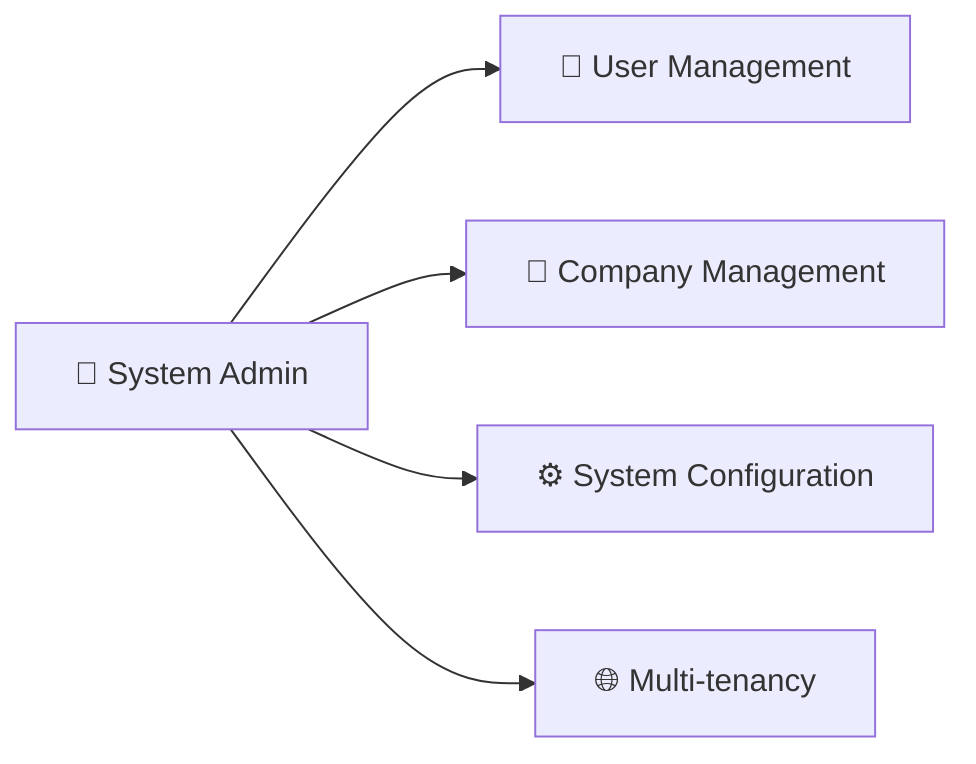
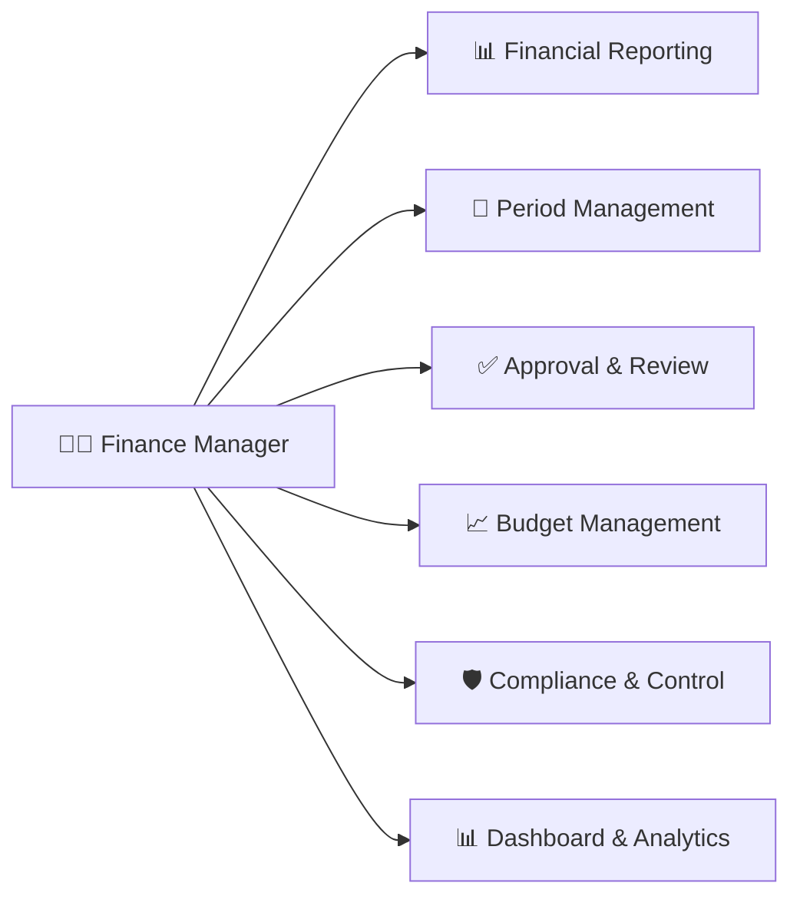
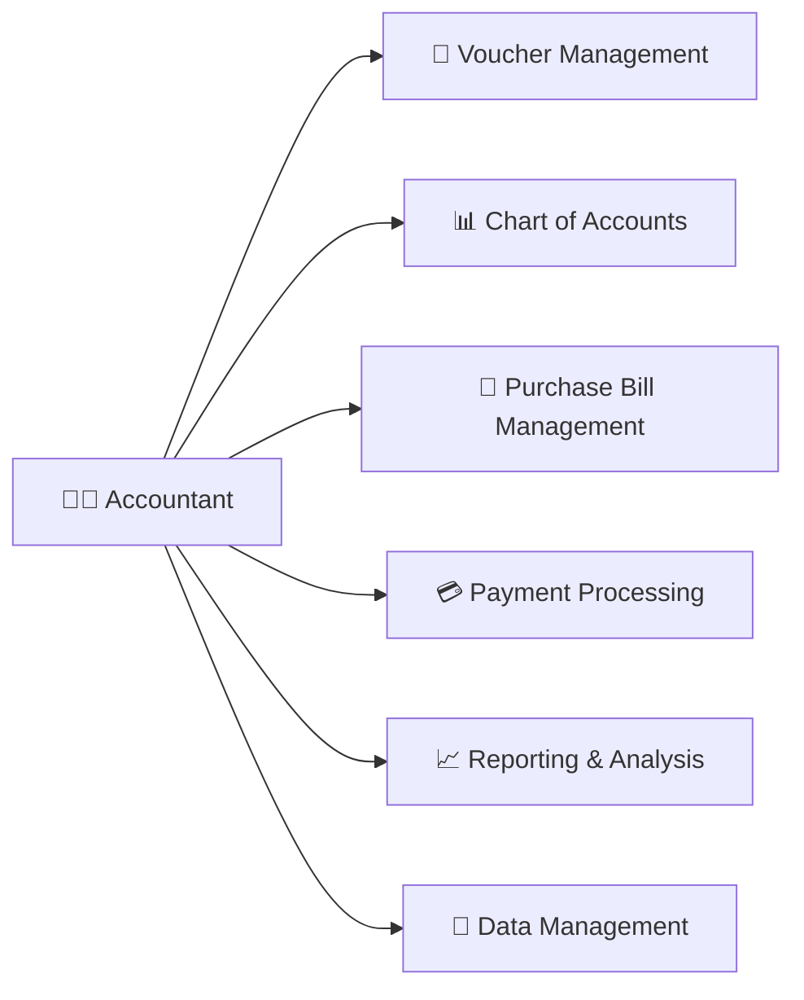
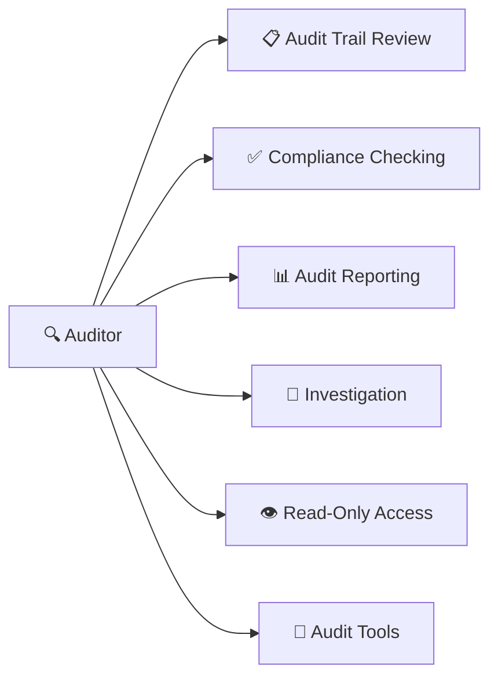
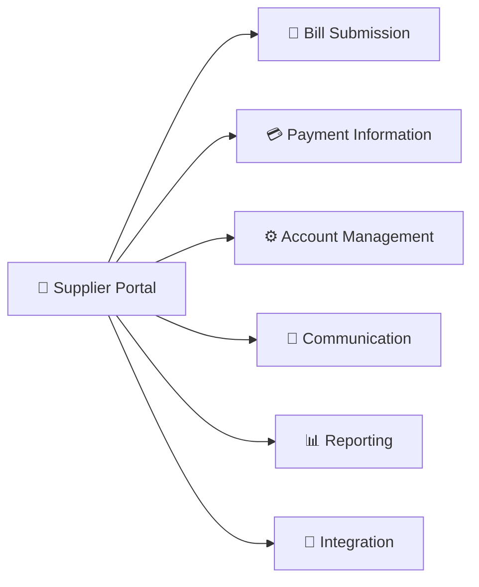
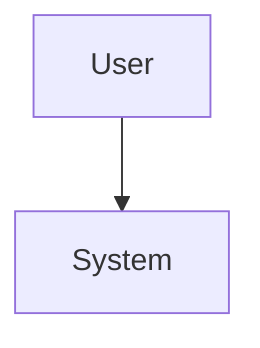
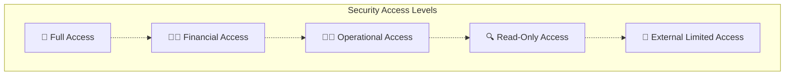
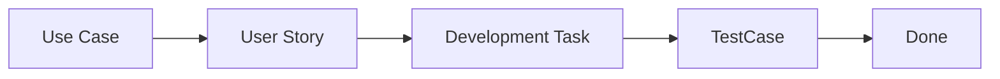
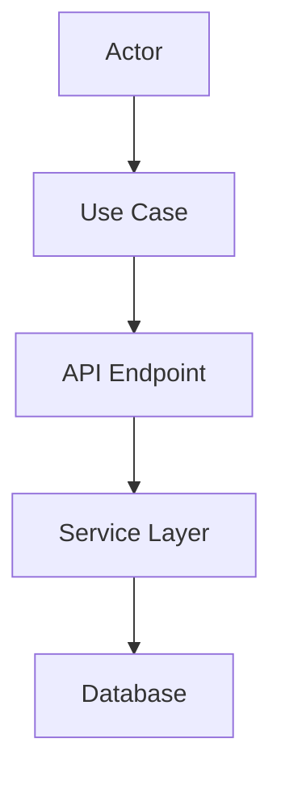

# Accounting System - Mermaid Use Case Diagrams

## 📋 Overview

This collection contains comprehensive **Mermaid-based use case diagrams** for each actor in the accounting system. These diagrams provide detailed functionality breakdowns and are optimized for:

- **GitHub/GitLab Integration**: Native markdown support
- **Browser Editing**: Edit directly in any browser
- **Modern Visualization**: Clean, responsive diagrams
- **Documentation**: Perfect for technical documentation
- **Collaboration**: Easy to share and modify

## 🎭 Actor-Specific Diagrams

### 1. 🏢 System Administrator
**File**: `system-administrator-detailed.md`



**Key Features**:
- **20 Use Cases** across 4 functional areas
- **User Lifecycle Management**: Create, update, deactivate, assign roles
- **Multi-tenant Operations**: Company creation, subscription management
- **System Security**: Policies, backups, monitoring
- **Include/Extend Relationships**: Complex operation dependencies

### 2. 💼 Finance Manager
**File**: `finance-manager-detailed.md`



**Key Features**:
- **22 Use Cases** across 6 functional areas
- **Strategic Oversight**: Financial reporting, period management
- **Approval Authority**: Large transactions, journal entries
- **Budget Control**: Creation, monitoring, variance analysis
- **Compliance Management**: Internal controls, regulatory requirements

### 3. 👩‍💼 Accountant
**File**: `accountant-detailed.md`



**Key Features**:
- **25 Use Cases** across 6 functional areas
- **Daily Operations**: Transaction processing, voucher management
- **Purchase Bill Lifecycle**: From creation to payment
- **Bank Integration**: Reconciliation, payment processing
- **Data Management**: Import/export, templates, backups

### 4. 🔍 Auditor
**File**: `auditor-detailed.md`



**Key Features**:
- **26 Use Cases** across 6 functional areas
- **Read-Only Access**: Historical data review, compliance verification
- **Investigation Tools**: Anomaly detection, transaction tracing
- **Audit Documentation**: Findings, reports, evidence management
- **Security Focus**: No modification capabilities, comprehensive logging

### 5. 🏢 Supplier Portal
**File**: `supplier-portal-detailed.md`



**Key Features**:
- **22 Use Cases** across 6 functional areas
- **Self-Service Portal**: Bill submission, status tracking
- **Integration Capabilities**: API, EDI, automated processing
- **Communication Hub**: Queries, notifications, document exchange
- **Limited Access**: Own company data only, secure isolation

## 🎨 Mermaid Styling Guide

### Color Scheme Used
| Actor | Primary Color | Hex Code | Purpose |
|-------|---------------|----------|---------|
| System Admin | Green | `#e8f5e9` / `#388e3c` | System authority |
| Finance Manager | Orange | `#fff3e0` / `#f57c00` | Financial oversight |
| Accountant | Blue-Green | `#e8f5e9` / `#388e3c` | Operations focus |
| Auditor | Purple | `#f3e5f5` / `#7b1fa2` | Review and compliance |
| Supplier Portal | Yellow | `#fff8e1` / `#f9a825` | External integration |

### Mermaid Syntax Features Used
```mermaid
graph TD
    %% Style definitions
    classDef actorStyle fill:#e3f2fd,stroke:#1976d2,stroke-width:2px
    classDef usecaseStyle fill:#e3f2fd,stroke:#1976d2,stroke-width:2px
    classDef systemStyle fill:#f9fbff,stroke:#1976d2,stroke-width:2px,stroke-dasharray: 5 5

    %% Actor definition
    Actor["👤 User"]:::actorStyle

    %% Use case grouping
    subgraph System["Module Name"]:::systemStyle
        UseCase1["Use Case 1"]:::usecaseStyle
        UseCase2["Use Case 2"]:::usecaseStyle
    end

    %% Relationships
    Actor --> UseCase1        %% Association
    UseCase1 -.-> UseCase2    %% Include (dashed)
    UseCase1 -.- UseCase3     %% Extend (dotted)
```

## 📊 System Statistics

| Metric | Count |
|--------|-------|
| **Total Actors** | 5 |
| **Total Use Cases** | 115 |
| **Include Relationships** | 25 |
| **Extend Relationships** | 20 |
| **Functional Modules** | 25 |
| **Security Boundaries** | 3 |

## 🚀 How to Use These Diagrams

### **In GitHub/GitLab Markdown**
```markdown
# My Documentation
## System Architecture

```

### **In VS Code**
1. Install **Mermaid Preview** extension
2. Open `.md` files
3. Use **Ctrl+Shift+P** → "Mermaid: Open Preview"

### **In Other Platforms**
- **GitLab**: Native Mermaid support in markdown
- **Bitbucket**: Use Mermaid extension
- **Confluence**: Install Mermaid macro
- **Notion**: Embed Mermaid diagrams
- **Slack**: Use Mermaid apps

### **Command Line Rendering**
```bash
# Install mmdc (Mermaid CLI)
npm install -g @mermaid-js/mermaid-cli

# Render to PNG
mmdc -i diagram.md -o diagram.png

# Render to SVG
mmdc -i diagram.md -o diagram.svg -t dark
```

## 🔐 Security Model Visualization



## 📱 Responsive Design

The Mermaid diagrams are designed to be:
- **Mobile-friendly**: Responsive layout
- **Print-ready**: High-quality export
- **Accessible**: Screen reader compatible
- **Theme-aware**: Light/dark mode support

## 🔄 Integration with Development Workflow

### **User Story Mapping**


### **API Design Mapping**


## 📈 Benefits of Mermaid Format

### **For Development Teams**
- ✅ **Version Control Friendly**: Text-based, diff-able
- ✅ **Collaborative**: Easy to edit and review
- ✅ **Integrated**: Works with existing documentation tools
- ✅ **Flexible**: Multiple output formats (PNG, SVG, PDF)

### **For Documentation**
- ✅ **Consistent**: Unified styling across all diagrams
- ✅ **Maintainable**: Easy to update and modify
- ✅ **Searchable**: Text content is searchable
- ✅ **Accessible**: Screen reader compatible

### **For Stakeholders**
- ✅ **Clear**: Visual representation of complex relationships
- ✅ **Interactive**: Can be explored in browsers
- ✅ **Professional**: Clean, modern appearance
- ✅ **Shareable**: Easy to distribute and present

## 🔗 Related Documentation

- **[PlantUML Versions](./)**: Original PlantUML format diagrams
- **[System Architecture](../)**: High-level system diagrams
- **[Technical Specifications](../../../)**: Detailed technical documentation
- **[API Documentation](../../../../backend/)**: REST API specifications

---

**Last Updated**: 2025-11-17
**Format**: Mermaid v10.0+
**Renderer**: @mermaid-js/mermaid-cli
**Compatibility**: GitHub, GitLab, VS Code, Modern Browsers