# Supplier Portal - Detailed Use Cases (Left-to-Right Layout)

```mermaid
graph LR
    %% Define styles
    classDef supplierStyle fill:#fff8e1,stroke:#f9a825,stroke-width:2px
    classDef usecaseStyle fill:#fff8e1,stroke:#f9a825,stroke-width:2px
    classDef extensionStyle fill:#e3f2fd,stroke:#1976d2,stroke-width:2px

    %% Main actor
    Supplier["🏢 Supplier Portal"]:::supplierStyle

    %% Bill Submission Use Cases
    SubmitBill["Submit New Bill"]:::usecaseStyle
    UploadDocuments["Upload Bill Documents"]:::usecaseStyle
    ValidateBillInfo["Validate Bill Information"]:::usecaseStyle
    TrackBillStatus["Track Bill Status"]:::usecaseStyle
    ResubmitBill["Resubmit Rejected Bill"]:::usecaseStyle
    WithdrawBill["Withdraw Submitted Bill"]:::usecaseStyle

    %% Payment Information Use Cases
    ViewPaymentStatus["View Payment Status"]:::usecaseStyle
    CheckPaymentHistory["Check Payment History"]:::usecaseStyle
    DownloadRemittance["Download Payment Remittance"]:::usecaseStyle
    UpdatePaymentDetails["Update Payment Details"]:::usecaseStyle
    PaymentPreferences["Set Payment Preferences"]:::usecaseStyle

    %% Account Management Use Cases
    RegisterAccount["Register Supplier Account"]:::usecaseStyle
    UpdateProfile["Update Company Profile"]:::usecaseStyle
    ManageContacts["Manage Contact Information"]:::usecaseStyle
    UpdateBanking["Update Banking Details"]:::usecaseStyle
    ManageUserAccess["Manage User Access"]:::usecaseStyle

    %% Communication Use Cases
    ReceiveNotifications["Receive Notifications"]:::usecaseStyle
    SendQueries["Send Query Messages"]:::usecaseStyle
    RespondToQueries["Respond to Queries"]:::usecaseStyle
    DownloadDocs["Download Supporting Documents"]:::usecaseStyle
    CommunicationHistory["Access Communication History"]:::usecaseStyle

    %% Reporting Use Cases
    TransactionSummary["View Transaction Summary"]:::usecaseStyle
    GenerateAgingReports["Generate Aging Reports"]:::usecaseStyle
    InvoiceHistory["Download Invoice History"]:::usecaseStyle
    AccountStatements["View Account Statements"]:::usecaseStyle
    ExportFinancialData["Export Financial Data"]:::usecaseStyle

    %% Integration Use Cases
    APISubmission["API Bill Submission"]:::usecaseStyle
    AutomatedProcessing["Automated Invoice Processing"]:::usecaseStyle
    RealTimeUpdates["Real-time Status Updates"]:::usecaseStyle
    EDI["Electronic Data Interchange"]:::usecaseStyle
    SystemHealth["System Health Check"]:::usecaseStyle

    %% Extension use cases
    RecurringBill["Submit Recurring Bill"]:::extensionStyle
    ValidateTaxInfo["Validate Tax Information"]:::extensionStyle
    NotificationPrefs["Set Notification Preferences"]:::extensionStyle
    ScheduleReportGen["Schedule Report Generation"]:::extensionStyle
    ExportToAccounting["Export to Accounting System"]:::extensionStyle

    %% Group related use cases
    subgraph BillSubmission["🧾 Bill Submission"]
        SubmitBill
        UploadDocuments
        ValidateBillInfo
        TrackBillStatus
        ResubmitBill
        WithdrawBill
    end

    subgraph PaymentInfo["💳 Payment Information"]
        ViewPaymentStatus
        CheckPaymentHistory
        DownloadRemittance
        UpdatePaymentDetails
        PaymentPreferences
    end

    subgraph AccountMgmt["⚙️ Account Management"]
        RegisterAccount
        UpdateProfile
        ManageContacts
        UpdateBanking
        ManageUserAccess
    end

    subgraph Communication["💬 Communication"]
        ReceiveNotifications
        SendQueries
        RespondToQueries
        DownloadDocs
        CommunicationHistory
    end

    subgraph Reporting["📊 Reporting"]
        TransactionSummary
        GenerateAgingReports
        InvoiceHistory
        AccountStatements
        ExportFinancialData
    end

    subgraph Integration["🔗 Integration"]
        APISubmission
        AutomatedProcessing
        RealTimeUpdates
        EDI
        SystemHealth
    end

    %% Actor to Use Case connections (left to right flow)
    Supplier --> SubmitBill
    Supplier --> UploadDocuments
    Supplier --> ValidateBillInfo
    Supplier --> TrackBillStatus
    Supplier --> ResubmitBill
    Supplier --> WithdrawBill

    Supplier --> ViewPaymentStatus
    Supplier --> CheckPaymentHistory
    Supplier --> DownloadRemittance
    Supplier --> UpdatePaymentDetails
    Supplier --> PaymentPreferences

    Supplier --> RegisterAccount
    Supplier --> UpdateProfile
    Supplier --> ManageContacts
    Supplier --> UpdateBanking
    Supplier --> ManageUserAccess

    Supplier --> ReceiveNotifications
    Supplier --> SendQueries
    Supplier --> RespondToQueries
    Supplier --> DownloadDocs
    Supplier --> CommunicationHistory

    Supplier --> TransactionSummary
    Supplier --> GenerateAgingReports
    Supplier --> InvoiceHistory
    Supplier --> AccountStatements
    Supplier --> ExportFinancialData

    Supplier --> APISubmission
    Supplier --> AutomatedProcessing
    Supplier --> RealTimeUpdates
    Supplier --> EDI
    Supplier --> SystemHealth

    %% Include relationships (dashed arrows)
    SubmitBill -.-> UploadDocuments
    SubmitBill -.-> ValidateBillInfo
    TrackBillStatus -.-> ReceiveNotifications
    CheckPaymentHistory -.-> DownloadRemittance
    AccountStatements -.-> TransactionSummary

    %% Extension relationships (dotted arrows)
    SubmitBill -.-> RecurringBill
    ValidateBillInfo -.-> ValidateTaxInfo
    ReceiveNotifications -.-> NotificationPrefs
    GenerateAgingReports -.-> ScheduleReportGen
    ExportFinancialData -.-> ExportToAccounting
```

## Use Case Details

### 🧾 Bill Submission
- **Submit New Bill**: Enter and submit new invoices to the accounting system
- **Upload Bill Documents**: Attach supporting documents (PDFs, images)
- **Validate Bill Information**: Verify bill data before submission
- **Track Bill Status**: Monitor approval and payment status
- **Resubmit Rejected Bill**: Correct and resubmit rejected invoices
- **Withdraw Submitted Bill**: Cancel submitted bills (if not processed)

### 💳 Payment Information
- **View Payment Status**: Check current payment status for bills
- **Check Payment History**: Review historical payment records
- **Download Payment Remittance**: Obtain payment advice and details
- **Update Payment Details**: Modify payment information
- **Set Payment Preferences**: Configure payment methods and timing

### ⚙️ Account Management
- **Register Supplier Account**: Create new supplier portal account
- **Update Company Profile**: Maintain company information
- **Manage Contact Information**: Update contact details and roles
- **Update Banking Details**: Modify bank account information
- **Manage User Access**: Control user permissions within supplier organization

### 💬 Communication
- **Receive Notifications**: Get system alerts and status updates
- **Send Query Messages**: Ask questions about bills or payments
- **Respond to Queries**: Reply to inquiries from accounting team
- **Download Supporting Documents**: Access required documentation
- **Access Communication History**: Review message history

### 📊 Reporting
- **View Transaction Summary**: Overview of transactions and status
- **Generate Aging Reports**: Create receivable aging analyses
- **Download Invoice History**: Export complete invoice records
- **View Account Statements**: Access account statements
- **Export Financial Data**: Download data for internal analysis

### 🔗 Integration
- **API Bill Submission**: Automated bill submission via API
- **Automated Invoice Processing**: System-driven invoice validation
- **Real-time Status Updates**: Live status synchronization
- **Electronic Data Interchange**: EDI transaction support
- **System Health Check**: Monitor system availability and performance

### 🔗 Key Relationships
- **Include relationships**: `SubmitBill` includes `UploadDocuments` and `ValidateBillInfo`, `TrackBillStatus` includes `ReceiveNotifications`
- **Extend relationships**: `SubmitBill` extends to `Submit Recurring Bill`, `ExportFinancialData` extends to `Export to Accounting System`

### 🔒 Security and Access Control
- **Data Isolation**: Suppliers can only access their own data
- **Limited Permissions**: No access to other supplier information
- **Secure Authentication**: Multi-factor authentication required
- **Audit Logging**: All supplier activities are logged