# System Administrator - Detailed Use Cases (Fixed)

```mermaid
graph TD
    %% Define styles
    classDef adminStyle fill:#e8f5e9,stroke:#388e3c,stroke-width:2px
    classDef usecaseStyle fill:#e3f2fd,stroke:#1976d2,stroke-width:2px
    classDef extensionStyle fill:#fff3e0,stroke:#f57c00,stroke-width:2px

    %% Main actor
    Admin["👤 System Administrator"]:::adminStyle

    %% User Management Use Cases
    CreateUser["Create User Account"]:::usecaseStyle
    UpdateUser["Update User Profile"]:::usecaseStyle
    DeactivateUser["Deactivate User Account"]:::usecaseStyle
    ResetPassword["Reset User Password"]:::usecaseStyle
    AssignRoles["Assign User Roles"]:::usecaseStyle
    ManagePermissions["Manage User Permissions"]:::usecaseStyle

    %% Company Management Use Cases
    CompanySettings["Configure Company Settings"]:::usecaseStyle
    CompanyProfile["Manage Company Profile"]:::usecaseStyle
    SetFiscalYear["Set Fiscal Year"]:::usecaseStyle
    TaxSettings["Configure Tax Settings"]:::usecaseStyle
    CurrencySettings["Manage Currency Settings"]:::usecaseStyle

    %% System Configuration Use Cases
    EmailSettings["Configure Email Settings"]:::usecaseStyle
    BackupSettings["Manage Backup Settings"]:::usecaseStyle
    SecurityPolicies["Configure Security Policies"]:::usecaseStyle
    SystemNotifications["Manage System Notifications"]:::usecaseStyle
    ViewLogs["View System Logs"]:::usecaseStyle

    %% Multi-tenancy Use Cases
    CreateCompany["Create New Company"]:::usecaseStyle
    ManageSubscriptions["Manage Company Subscriptions"]:::usecaseStyle
    MonitorUsage["Monitor Resource Usage"]:::usecaseStyle
    TenantManagement["Tenant Isolation Management"]:::usecaseStyle

    %% Extension use cases
    ExportLogs["Export System Logs"]:::extensionStyle
    UpgradePlan["Upgrade Subscription Plan"]:::extensionStyle
    Configure2FA["Configure Two-Factor Auth"]:::extensionStyle

    %% Group related use cases
    subgraph UserMgmt["👥 User Management"]
        CreateUser
        UpdateUser
        DeactivateUser
        ResetPassword
        AssignRoles
        ManagePermissions
    end

    subgraph CompanyMgmt["🏢 Company Management"]
        CompanySettings
        CompanyProfile
        SetFiscalYear
        TaxSettings
        CurrencySettings
    end

    subgraph SysConfig["⚙️ System Configuration"]
        EmailSettings
        BackupSettings
        SecurityPolicies
        SystemNotifications
        ViewLogs
    end

    subgraph MultiTenant["🌐 Multi-tenancy"]
        CreateCompany
        ManageSubscriptions
        MonitorUsage
        TenantManagement
    end

    %% Actor to Use Case connections
    Admin --> CreateUser
    Admin --> UpdateUser
    Admin --> DeactivateUser
    Admin --> ResetPassword
    Admin --> AssignRoles
    Admin --> ManagePermissions

    Admin --> CompanySettings
    Admin --> CompanyProfile
    Admin --> SetFiscalYear
    Admin --> TaxSettings
    Admin --> CurrencySettings

    Admin --> EmailSettings
    Admin --> BackupSettings
    Admin --> SecurityPolicies
    Admin --> SystemNotifications
    Admin --> ViewLogs

    Admin --> CreateCompany
    Admin --> ManageSubscriptions
    Admin --> MonitorUsage
    Admin --> TenantManagement

    %% Include relationships (dashed arrows)
    ManagePermissions -.-> AssignRoles
    ManagePermissions -.-> UpdateUser
    CreateCompany -.-> CompanySettings
    TenantManagement -.-> MonitorUsage

    %% Extension relationships (dotted arrows)
    ViewLogs -.-> ExportLogs
    ManageSubscriptions -.-> UpgradePlan
    SecurityPolicies -.-> Configure2FA
```

## Use Case Details

### 👥 User Management
- **Create User Account**: Add new users to the system with default roles
- **Update User Profile**: Modify user information and preferences
- **Deactivate User Account**: Disable user access while preserving data
- **Reset User Password**: Reset forgotten or compromised passwords
- **Assign User Roles**: Grant appropriate role-based permissions
- **Manage User Permissions**: Fine-tune access controls and permissions

### 🏢 Company Management
- **Configure Company Settings**: Set up company-specific configurations
- **Manage Company Profile**: Update company information and branding
- **Set Fiscal Year**: Define accounting periods and fiscal calendars
- **Configure Tax Settings**: Set up tax rates and compliance rules
- **Manage Currency Settings**: Configure multiple currency support

### ⚙️ System Configuration
- **Configure Email Settings**: Set up SMTP and notification templates
- **Manage Backup Settings**: Configure automated backup schedules
- **Configure Security Policies**: Define password rules and access controls
- **Manage System Notifications**: Set up system alerts and notifications
- **View System Logs**: Monitor system activity and error logs

### 🌐 Multi-tenancy
- **Create New Company**: Onboard new tenant organizations
- **Manage Company Subscriptions**: Handle billing and subscription plans
- **Monitor Resource Usage**: Track tenant resource consumption
- **Tenant Isolation Management**: Ensure data separation between tenants

### 🔗 Relationships
- **Include relationships** (mandatory): `ManagePermissions` includes `AssignRoles`, `CreateCompany` includes `CompanySettings`
- **Extend relationships** (optional): `ViewLogs` extends to `Export System Logs`, `SecurityPolicies` extends to `Configure Two-Factor Auth`