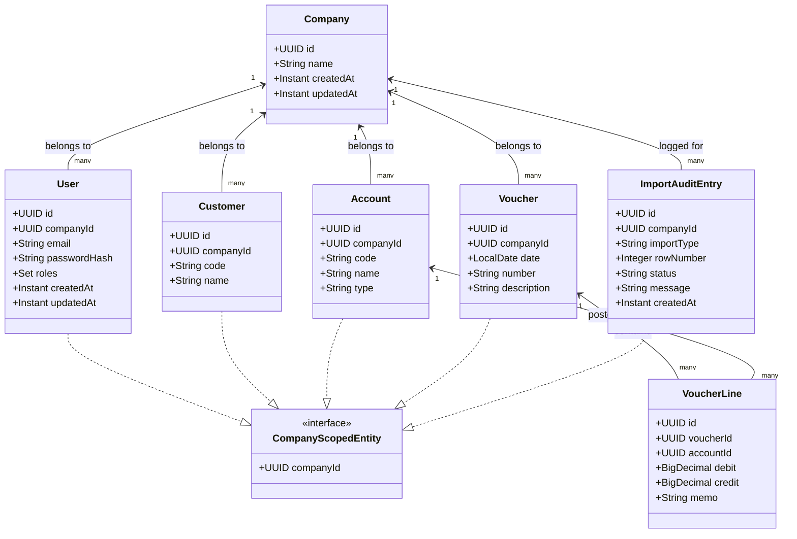

## Class Diagram - Core Domain

```mermaid
classDiagram
  class Company {
    +UUID id
    +String name
    +Instant createdAt
    +Instant updatedAt
  }

  class User {
    +UUID id
    +UUID companyId
    +String email
    +String passwordHash
    +Set<Role> roles
    +Instant createdAt
    +Instant updatedAt
  }

  class Customer {
    +UUID id
    +UUID companyId
    +String code
    +String name
  }

  class Account {
    +UUID id
    +UUID companyId
    +String code
    +String name
    +String type
  }

  class Voucher {
    +UUID id
    +UUID companyId
    +LocalDate date
    +String number
    +String description
  }

  class VoucherLine {
    +UUID id
    +UUID voucherId
    +UUID accountId
    +BigDecimal debit
    +BigDecimal credit
    +String memo
  }

  class ImportAuditEntry {
    +UUID id
    +UUID companyId
    +String importType
    +Integer rowNumber
    +String status
    +String message
    +Instant createdAt
  }

  class CompanyScopedEntity {
    <<interface>>
    +UUID companyId
  }

  Company "1" <-- "many" User : belongs to
  Company "1" <-- "many" Customer : belongs to
  Company "1" <-- "many" Account : belongs to
  Company "1" <-- "many" Voucher : belongs to
  Voucher "1" <-- "many" VoucherLine : contains
  Account "1" <-- "many" VoucherLine : posted to
  Company "1" <-- "many" ImportAuditEntry : logged for

  User ..|> CompanyScopedEntity
  Customer ..|> CompanyScopedEntity
  Account ..|> CompanyScopedEntity
  Voucher ..|> CompanyScopedEntity
  ImportAuditEntry ..|> CompanyScopedEntity
```
