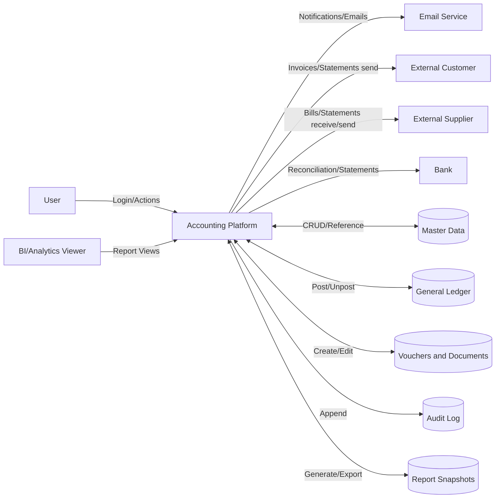

## DFD Level 0 — System Context

```mermaid
flowchart LR
  title["Accounting Platform"]

  extUser[User]
  extCustomer[External Customer]
  extSupplier[External Supplier]
  extBank[Bank]
  extEmail[Email Service]
  extBI[BI/Analytics Viewer]

  storeGL[(General Ledger)]
  storeMD[(Master Data)]
  storeDocs[(Vouchers and Documents)]
  storeAudit[(Audit Log)]
  storeReports[(Report Snapshots)]

  extUser -->|Login/Actions| title
  title -->|Notifications/Emails| extEmail
  title -->|Invoices/Statements send| extCustomer
  title -->|Bills/Statements receive/send| extSupplier
  title -->|Reconciliation/Statements| extBank
  extBI -->|Report Views| title

  title <-->|CRUD/Reference| storeMD
  title <-->|Post/Unpost| storeGL
  title <-->|Create/Edit| storeDocs
  title -->|Append| storeAudit
  title <-->|Generate/Export| storeReports
```
