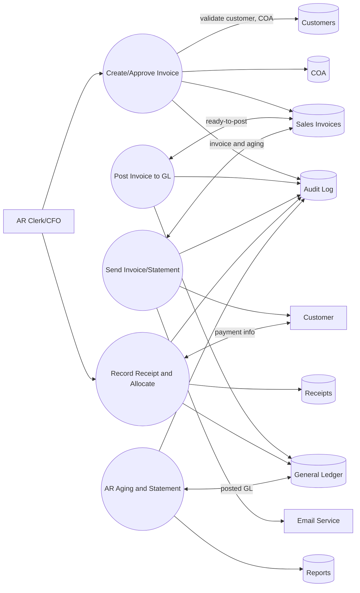

## DFD Level 2 — Order-to-Cash (AR)

```mermaid
flowchart LR
  user[AR Clerk/CFO]
  customer[Customer]
  email[Email Service]

  mdCust[(Customers)]
  mdCOA[(COA)]
  docsInv[(Sales Invoices)]
  receipts[(Receipts)]
  gl[(General Ledger)]
  audit[(Audit Log)]
  rpt[(Reports)]

  P1(("Create/Approve Invoice"))
  P2(("Post Invoice to GL"))
  P3(("Send Invoice/Statement"))
  P4(("Record Receipt and Allocate"))
  P5(("AR Aging and Statement"))

  user --> P1
  P1 -->|validate customer, COA| mdCust
  P1 --> mdCOA
  P1 --> docsInv
  P1 --> audit

  P2 <-->|ready-to-post| docsInv
  P2 --> gl
  P2 --> audit

  P3 <-->|invoice and aging| docsInv
  P3 --> customer
  P3 --> email
  P3 --> audit

  P4 <-->|payment info| customer
  user --> P4
  P4 --> receipts
  P4 --> gl
  P4 --> audit

  P5 <-->|posted GL| gl
  P5 --> rpt
  P5 --> audit
```
