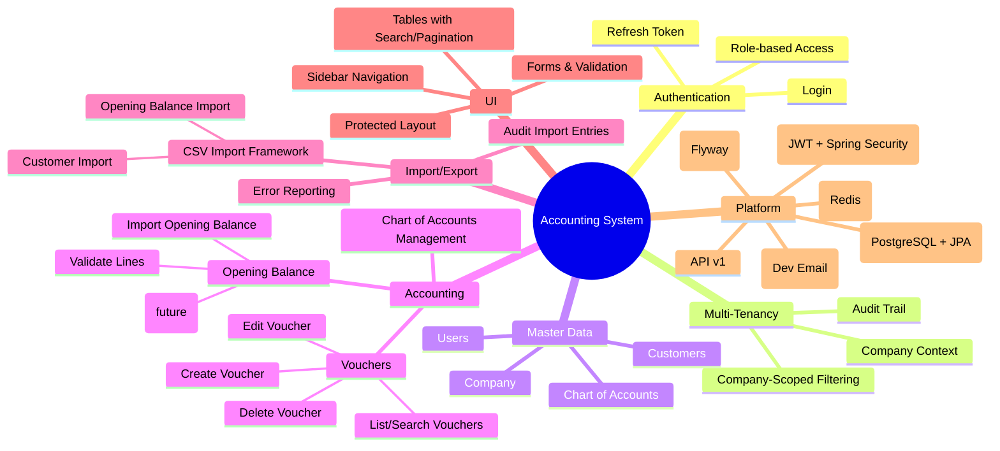

## Functional Decomposition

```mermaid
mindmap
  root((Accounting System))
    Authentication
      Login
      Refresh Token
      Role-based Access
    Multi-Tenancy
      Company Context
      Company-Scoped Filtering
      Audit Trail
    Master Data
      Company
      Users
      Customers
      Chart of Accounts
    Accounting
      Chart of Accounts Management
      Vouchers
        Create Voucher
        Edit Voucher
        List/Search Vouchers
        Delete Voucher
      Opening Balance
        Import Opening Balance
        Validate Lines
        Post to Ledger (future)
    Import/Export
      CSV Import Framework
        Customer Import
        Opening Balance Import
      Audit Import Entries
      Error Reporting
    UI
      Protected Layout
      Sidebar Navigation
      Tables with Search/Pagination
      Forms & Validation
    Platform
      API v1
      Security (JWT + Spring Security)
      Persistence (PostgreSQL + JPA)
      Migrations (Flyway)
      Cache/Queue (Redis)
      Maildev (Dev Email)
```
