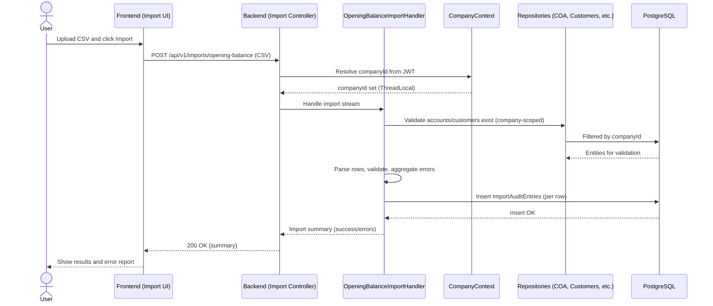

## Sequence Diagram - Import Opening Balance

```mermaid
sequenceDiagram
  actor U as User
  participant FE as Frontend (Import UI)
  participant BE as Backend (Import Controller)
  participant IH as OpeningBalanceImportHandler
  participant CC as CompanyContext
  participant REPO as Repositories (COA, Customers, etc.)
  participant DB as PostgreSQL

  U->>FE: Upload CSV and click Import
  FE->>BE: POST /api/v1/imports/opening-balance (CSV)
  BE->>CC: Resolve companyId from JWT
  CC-->>BE: companyId set (ThreadLocal)
  BE->>IH: Handle import stream
  IH->>REPO: Validate accounts/customers exist (company-scoped)
  REPO->>DB: Filtered by companyId
  DB-->>REPO: Entities for validation
  IH->>IH: Parse rows, validate, aggregate errors
  IH->>DB: Insert ImportAuditEntries (per row)
  DB-->>IH: Insert OK
  IH-->>BE: Import summary (success/errors)
  BE-->>FE: 200 OK {summary}
  FE-->>U: Show results and error report
```
