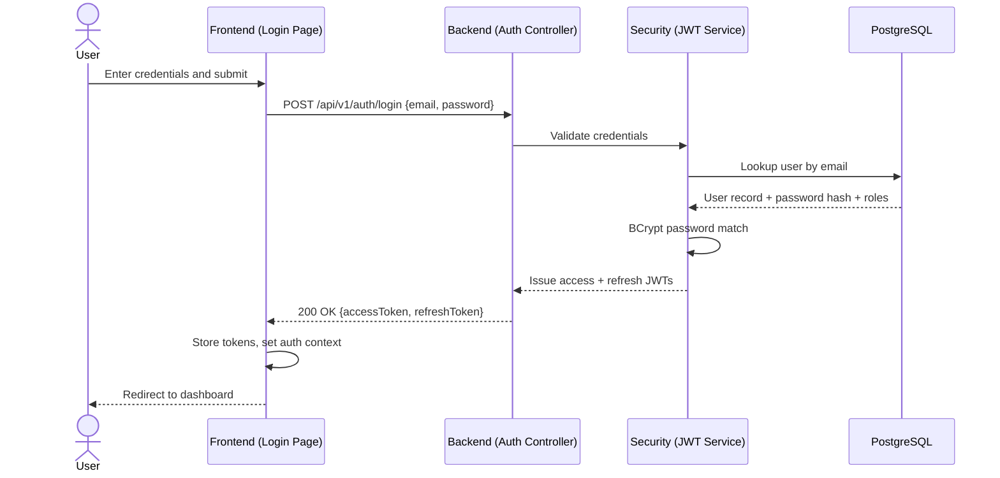

## Sequence Diagram - Login

```mermaid
sequenceDiagram
  actor U as User
  participant FE as Frontend (Login Page)
  participant BE as Backend (Auth Controller)
  participant SEC as Security (JWT Service)
  participant DB as PostgreSQL

  U->>FE: Enter credentials and submit
  FE->>BE: POST /api/v1/auth/login {email, password}
  BE->>SEC: Validate credentials
  SEC->>DB: Lookup user by email
  DB-->>SEC: User record + password hash + roles
  SEC->>SEC: BCrypt password match
  SEC-->>BE: Issue access + refresh JWTs
  BE-->>FE: 200 OK {accessToken, refreshToken}
  FE->>FE: Store tokens, set auth context
  FE-->>U: Redirect to dashboard
```

