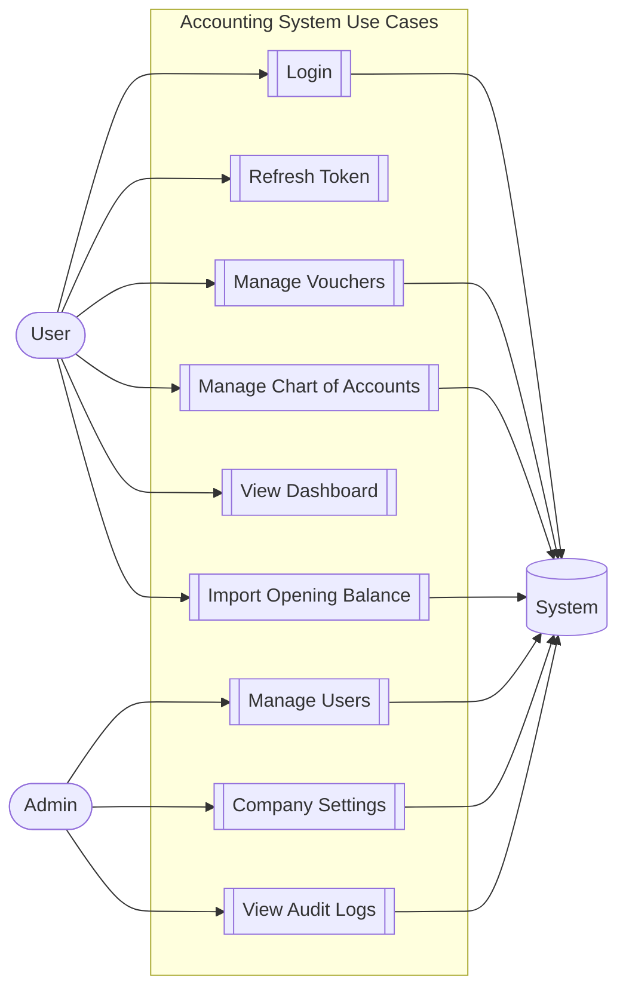

## Use Case Diagram

```mermaid
flowchart LR
  User([User])
  Admin([Admin])
  System[(System)]

  subgraph UseCases [Accounting System Use Cases]
    UC_Login[[Login]]
    UC_Refresh[[Refresh Token]]
    UC_ManageUsers[[Manage Users]]
    UC_ManageCompany[[Company Settings]]
    UC_ViewDashboard[[View Dashboard]]
    UC_COA[[Manage Chart of Accounts]]
    UC_Voucher[[Manage Vouchers]]
    UC_ImportOB[[Import Opening Balance]]
    UC_ViewAudit[[View Audit Logs]]
  end

  User --> UC_Login
  User --> UC_Refresh
  User --> UC_ViewDashboard
  User --> UC_Voucher
  User --> UC_COA
  User --> UC_ImportOB

  Admin --> UC_ManageUsers
  Admin --> UC_ManageCompany
  Admin --> UC_ViewAudit

  UC_Login --> System
  UC_Voucher --> System
  UC_COA --> System
  UC_ImportOB --> System
  UC_ManageUsers --> System
  UC_ManageCompany --> System
  UC_ViewAudit --> System
```

