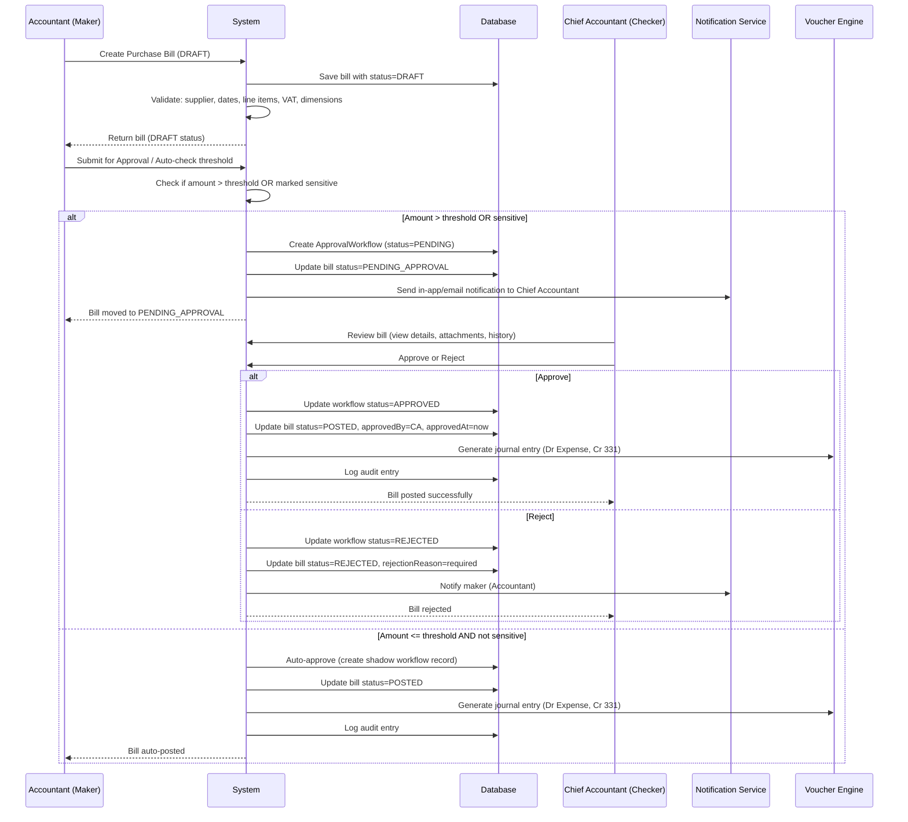
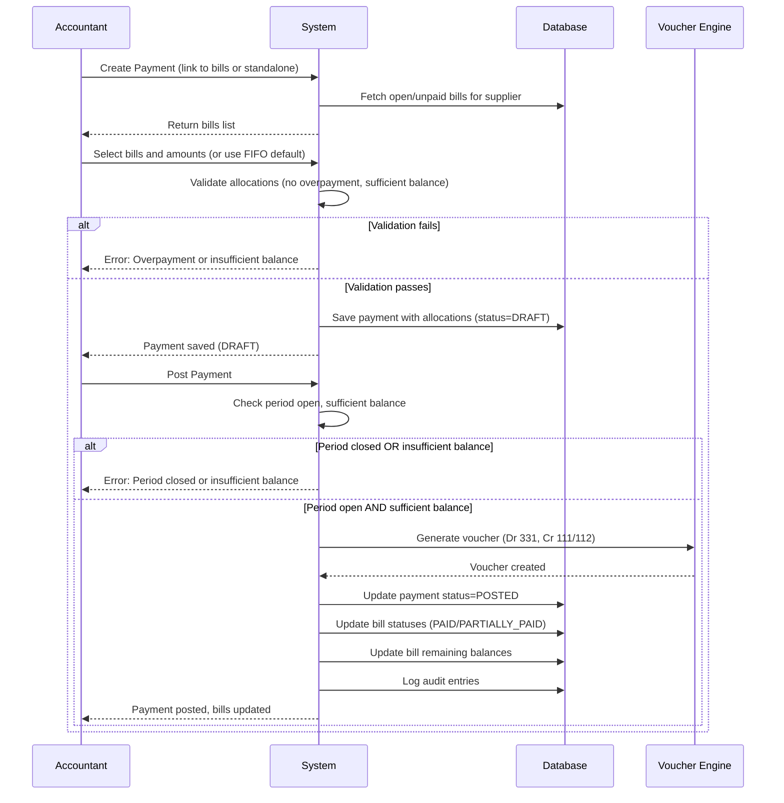
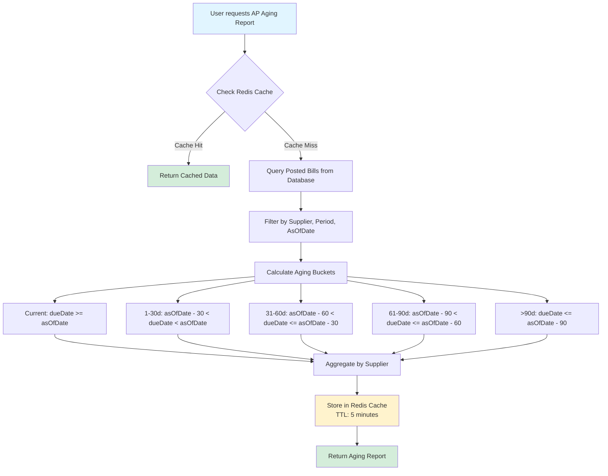
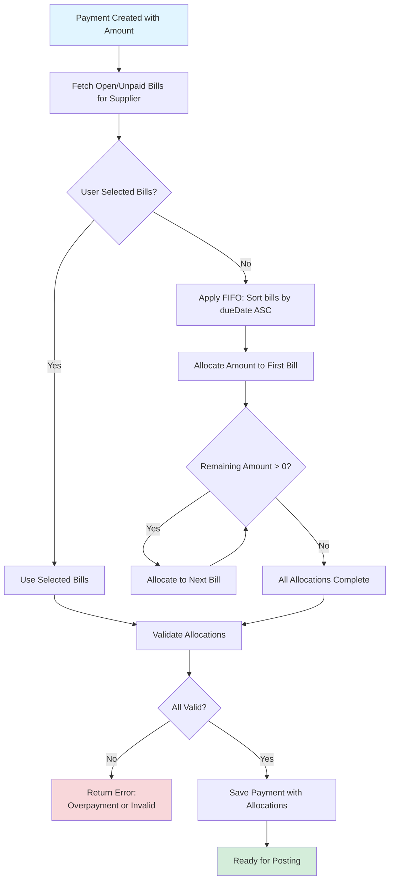

# Epic Technical Specification: Accounts Payable (AP) Module

Date: 2025-11-15
Author: thanhtoan
Epic ID: 4
Status: Draft

---

## Overview

The Accounts Payable (AP) Module delivers end-to-end supplier bill, approval, and payment workflows with strict validations (Maker-Checker), linkage to master data (supplier, chart of accounts), automated VAT/bookkeeping, full compliance, and auditable period/role controls. This epic addresses the core procure-to-pay cycle, enabling accountants to efficiently manage supplier bills, enforce approval workflows for high-value transactions, track payments, generate aging reports, and maintain full audit compliance per Vietnamese accounting standards (TT200). The module builds upon Epic 3's voucher engine foundation, extending it with AP-specific business logic, approval workflows, and reporting capabilities.

### PRD Goal Alignment

This epic directly addresses the following PRD goals and business objectives:

**PRD Goal 1: Automate Core Accounting Operations** (Source: `docs/PRD/goals-and-background-context.md`)
- **Alignment:** The AP Module automates the complete procure-to-pay cycle, including purchase bill creation (FR18), payment recording (FR19), and automated journal entry generation (Dr Expense/Cr AP 331). This eliminates manual data entry and reduces processing time for supplier bills and payments.

**PRD Goal 2: Minimize Manual Work and Accounting Errors** (Source: `docs/PRD/goals-and-background-context.md`)
- **Alignment:** Through automated validation (supplier picker, unique bill numbers, VAT sum checks, leaf-only account enforcement), draft autosave, batch import capabilities, and FIFO payment allocation, the module reduces manual steps by ≥30% and prevents common posting errors (e.g., duplicate bills, overpayments, incorrect VAT calculations). This contributes to the PRD target of ≥50% reduction in misposting errors.

**PRD Goal 3: Guarantee Compliance with Enterprise Standards** (Source: `docs/PRD/goals-and-background-context.md`)
- **Alignment:** The module enforces maker-checker approval workflows (FR21) for high-value transactions, implements period locking to prevent posting to closed periods, maintains immutable audit trails for all AP activities (Story 4.7), and ensures TT200 compliance through automated VAT GL mapping (account 3331) and ND123-compliant reporting. All operations are logged with user, timestamp, and change diffs, meeting enterprise audit requirements.

**PRD Goal 4: Enforce Security and Row-Level Access Controls** (Source: `docs/PRD/goals-and-background-context.md`)
- **Alignment:** The module enforces RBAC at the API level (FR47) with role-based permissions (Accountant, Chief Accountant, CFO), implements approver ≠ creator validation at database and application levels, and ensures company-scoped data isolation through `CompanyScopedEntity` pattern. All AP operations respect role permissions, with aging reports and statements filtered by user role.

**Business Value Contribution:**
- **Reduced Month-End Close Time:** Automated bill processing, approval workflows, and payment allocation reduce manual reconciliation time, contributing to the PRD target of 30-40% reduction in month-end close cycles.
- **Compliance Confidence:** TT200-compliant VAT handling, aging reports, and supplier statements ensure statutory reporting accuracy, reducing audit risk and external consulting dependency (target: $500+ savings per close cycle).
- **Operational Efficiency:** Real-time AP aging reports, overdue alerts, and supplier statement reconciliation enable proactive cash flow management and supplier relationship maintenance.

## Objectives and Scope

### In-Scope

- **Purchase Bills Management (Story 4.1):** Create, edit, and validate supplier bills with comprehensive validation (supplier picker, unique bill numbers, date controls, attachments, line items with VAT, draft autosave, batch import)
- **Maker-Checker Approval Workflow (Story 4.2):** Configurable approval threshold (default 20M VND), in-app/email notifications, approver ≠ creator enforcement, workflow state transitions with audit logging
- **Cash Payments (Story 4.3):** Payment entry linked to bills or standalone, FIFO allocation, overpayment prevention, payment approval workflow, voucher posting (Dr AP, Cr cash/bank)
- **AP Aging and Overdue Alerts (Story 4.4):** Aging buckets (Current, 1-30d, 31-60d, 61-90d, >90d), drill-down capabilities, exportable reports, dashboard badges, reminder/alert system
- **Supplier Statement & Reconciliation (Story 4.5):** Statement generation (summary and detailed views), TT200-compliant PDF/Excel export, supplier statement import with comparison, dispute logging
- **VAT Handling and Reporting (Story 4.6):** VAT rate validation (0/5/10/exempt), VAT sum validation, TT200 GL mapping (VAT 3331 leg), Input VAT report with ND123 compliance, manual VAT corrections
- **Audit Trail and Compliance (Story 4.7):** Complete audit log for all AP activities, timeline view, DR plan with scheduled backups, cryptographic chain hashing, 10+ years retention

### Out-of-Scope

- Multi-currency support (single-currency VND only per PRD)
- Deep e-invoice integration (deferred to post-MVP)
- Automated bank reconciliation (manual reconciliation only)
- Advanced payment scheduling/automation
- Supplier portal for self-service bill submission
- Complex approval routing (multi-level hierarchies beyond maker-checker)

## System Architecture Alignment

The AP Module aligns with the established multi-tenant architecture, leveraging the company-scoped entity pattern for data isolation. Backend implementation follows the Spring Boot 3.5.7 architecture with JPA/Hibernate for persistence, extending the voucher engine from Epic 3. The module integrates with:

- **Data Architecture:** Utilizes `purchase_bills` and `ap_payments` tables (as defined in data-architecture.md), linked to `suppliers` master data and `chart_of_accounts` (account 331 for AP). All entities extend `CompanyScopedEntity` for automatic company filtering.

- **Security Architecture:** Enforces RBAC at API level (Admin, Accountant, Chief Accountant, CFO roles), with maker-checker workflow requiring approver ≠ creator. JWT authentication and company context filtering ensure data isolation.

- **Frontend Architecture:** Implements shadcn/ui components with custom `DataTablePro` for bill/payment lists, `VoucherLineGrid` patterns for payment allocation, and `MoneyInput` for Vietnamese currency formatting. Follows the persistent left sidebar navigation pattern.

- **Integration Points:** Depends on Epic 3's voucher posting engine, period management for date validation, supplier master data from Epic 2, and audit logging infrastructure. Generates journal entries that integrate with the GL system.

## Detailed Design

### Services and Modules

| Service/Module | Responsibility | Inputs | Outputs | Owner |
|----------------|----------------|--------|---------|-------|
| **PurchaseBillService** | Manages purchase bill CRUD, validation, draft autosave, batch import | Bill data, supplier ID, line items, attachments | PurchaseBill entity, validation errors, audit logs | Backend Service Layer |
| **ApprovalWorkflowService** | Handles maker-checker approval logic, threshold checks, notifications | Bill ID, approver ID, approval decision | Workflow state transitions, notifications, audit entries | Backend Service Layer |
| **PaymentService** | Processes payment entry, bill allocation (FIFO), overpayment validation | Payment data, bill IDs, allocation rules | Payment entity, updated bill statuses, journal entries | Backend Service Layer |
| **APAgingService** | Calculates aging buckets, generates aging reports, overdue detection | Supplier ID, date range, period filters | Aging report data, overdue alerts | Backend Service Layer |
| **SupplierStatementService** | Generates supplier statements, imports supplier statements, reconciliation | Supplier ID, statement type, import file | Statement PDF/Excel, reconciliation results, dispute logs | Backend Service Layer |
| **VATService** | Validates VAT rates, calculates VAT totals, generates VAT reports | Line items with VAT rates, period filters | VAT calculations, ND123-compliant reports, correction logs | Backend Service Layer |
| **APAuditService** | Logs all AP activities, generates timeline views, manages DR backups | Action events, user context, entity changes | Audit log entries, timeline data, backup archives | Backend Service Layer |
| **PurchaseBillController** | REST API endpoints for bill operations | HTTP requests (GET, POST, PUT, DELETE) | JSON responses, file uploads/downloads | Backend Controller Layer |
| **PaymentController** | REST API endpoints for payment operations | HTTP requests | JSON responses | Backend Controller Layer |
| **APReportController** | REST API endpoints for aging, statements, VAT reports | HTTP requests with filters | JSON/PDF/Excel responses | Backend Controller Layer |
| **PurchaseBillForm** (Frontend) | Bill entry/edit UI with validation, attachments, line items | User input, supplier data, account data | Form submission, draft saves | Frontend Feature |
| **PaymentForm** (Frontend) | Payment entry UI with bill linking, allocation interface | User input, open bills list, bank account data | Payment submission | Frontend Feature |
| **APAgingReport** (Frontend) | Aging report display with drill-down, filters, export | Report data, filters | Rendered report, exported files | Frontend Feature |

### Data Models and Contracts

**Key Entities:**
- `PurchaseBill`: Core bill entity with supplier reference, bill number (unique per supplier/year), dates, status (DRAFT, PENDING_APPROVAL, POSTED, REJECTED, PAID, PARTIALLY_PAID), total amounts, VAT, creator/approver references, attachments (max 10 files, 20MB total)
- `PurchaseBillLine`: Line items with account (leaf/postable enforced), description (required), quantity × price (positive only), VAT rate (0/5/10/exempt), optional dimensions (cost center, item)
- `APPayment`: Payment entity with supplier, bank/cash account, amount, allocations to bills, standalone flag, linked voucher
- `PaymentAllocation`: Many-to-many relationship with FIFO ordering, allocated amounts (cannot exceed bill remaining balance)
- `ApprovalWorkflow`: Workflow tracking with maker/checker (enforced ≠), status transitions, rejection reasons, threshold amounts

**Database Constraints:**
- Unique constraint: `bill_number` per supplier per year
- Foreign keys: supplier_id, account_id (leaf-only validation), created_by_id, approved_by_id
- Check constraints: positive amounts, valid date ranges, VAT rate enum values
- Indexes: supplier_id, bill_date, status, company_id (for multi-tenancy filtering)

### APIs and Interfaces

**Purchase Bill Endpoints:**
- `GET /api/v1/purchase-bills` - List with pagination, search, filters (supplier, status, date range)
- `POST /api/v1/purchase-bills` - Create bill (validates supplier, dates, line items, VAT, dimensions)
- `PUT /api/v1/purchase-bills/{id}` - Update (only DRAFT, creator-only unless admin)
- `DELETE /api/v1/purchase-bills/{id}` - Delete (only DRAFT, creator-only unless admin)
- `POST /api/v1/purchase-bills/{id}/submit-for-approval` - Trigger approval workflow
- `POST /api/v1/purchase-bills/{id}/approve` - Approve/reject (Chief Accountant/CFO, enforces approver ≠ creator)
- `POST /api/v1/purchase-bills/batch-import` - Excel import with atomic save, error reporting

**Payment Endpoints:**
- `GET /api/v1/ap-payments` - List with pagination and filters
- `POST /api/v1/ap-payments` - Create payment (linked to bills or standalone)
- `POST /api/v1/ap-payments/{id}/allocate` - Manual allocation override (FIFO default)
- `POST /api/v1/ap-payments/{id}/post` - Post payment, generate voucher (Dr 331, Cr 111/112)

**Report Endpoints:**
- `GET /api/v1/ap-aging` - Aging report (buckets: Current, 1-30d, 31-60d, 61-90d, >90d)
- `GET /api/v1/supplier-statements/{supplierId}` - Generate statement (PDF/Excel, TT200-compliant)
- `POST /api/v1/supplier-statements/{supplierId}/import` - Import supplier statement, reconciliation
- `GET /api/v1/vat-reports/input-vat` - Input VAT report (ND123-compliant format)

**Request/Response Models:**
- DTOs follow standard pattern: `PurchaseBillDTO`, `APPaymentDTO`, `ApprovalWorkflowDTO`, `APAgingReportDTO`
- Error responses: `{ "error": "code", "message": "...", "details": {...} }`
- Pagination: Standard Spring `Page<T>` with `page`, `size`, `totalElements`, `totalPages`

### Workflows and Sequencing

#### Purchase Bill Approval Flow

#### Payment Allocation and Posting Flow

#### AP Aging Calculation Flow

#### Payment Allocation FIFO Logic

## Non-Functional Requirements

### Performance

- **Response Times:** Bill list page load < 2s (with pagination, 20 items/page), bill form submission < 1s, aging report generation < 5s for typical date ranges (cached results < 500ms)
- **Caching Strategy:** Redis caching for AP aging reports (TTL: 5 minutes), invalidated on bill/payment post or period close. Cache keys: `ap-aging:{supplierId}:{periodId}:{asOfDate}`
- **Database Optimization:** Indexes on `purchase_bills.supplier_id`, `purchase_bills.bill_date`, `purchase_bills.status`, `ap_payments.supplier_id`, `ap_payments.payment_date`. Avoid N+1 queries using JPA `@EntityGraph` for bill lines and allocations
- **Batch Operations:** Batch import processes up to 1000 rows atomically, with progress feedback for larger imports
- **File Handling:** Attachment uploads limited to 20MB total per bill, 10 files max. Files stored in Supabase Storage with CDN delivery

### Security

- **RBAC Enforcement:** All API endpoints enforce role-based permissions at controller/service level using `@PreAuthorize` annotations. Frontend UI hiding is not a security boundary
- **Maker-Checker Validation:** System enforces approver ≠ creator at database constraint level and application logic. Approval threshold configurable by Admin (default 20M VND)
- **Data Isolation:** All entities extend `CompanyScopedEntity`, automatically filtered by `company_id` via `CompanyScopeAspect`. JWT token contains company context
- **Audit Trail:** All bill/payment create, edit, post, approve, import, delete operations logged to `audit_logs` table with user ID, timestamp, IP address, and change diffs. Append-only, immutable
- **Input Validation:** Server-side validation for all inputs (supplier exists, dates valid, amounts positive, VAT rates valid, required dimensions present). SQL injection prevention via parameterized queries (JPA)

### Reliability/Availability

- **Transaction Integrity:** All bill/payment operations wrapped in `@Transactional` with rollback on validation failures. Batch imports use atomic transactions (all-or-nothing)
- **Period Locking:** System prevents posting to closed periods with clear error messages. Period close validation checks for no DRAFT bills before allowing close
- **Overpayment Prevention:** Payment allocation logic enforces no overpayment at database constraint level (check constraint: `allocated_amount <= bill.remaining_balance`)
- **Draft Recovery:** Draft bills auto-saved every 30 seconds. Creator and Admin can recover drafts. Drafts persist for 30 days, then archived
- **Error Handling:** Graceful degradation: If approval workflow service unavailable, bills default to auto-approve (logged as shadow record). Notification failures logged but don't block posting

### Observability

- **Structured Logging:** All AP operations logged with structured JSON format: `{ "action": "bill.created", "billId": 123, "userId": 456, "companyId": 789, "timestamp": "..." }`
- **Metrics:** Track bill creation rate, approval workflow duration, payment processing time, aging report generation time. Exposed via Spring Actuator endpoints
- **Audit Timeline View:** UI provides timeline view of all AP activities per bill/payment, filterable by user, action type, date range. Exportable as PDF with legal appendix
- **Slow Query Monitoring:** Database queries > 1s logged with query plan. Aging report queries monitored for performance degradation
- **Health Checks:** `/actuator/health` endpoint includes AP service health (database connectivity, Redis cache availability)

## Dependencies and Integrations

### Backend Dependencies

**Spring Boot 3.5.7 Core:**
- `spring-boot-starter-web` (REST API)
- `spring-boot-starter-data-jpa` (Persistence)
- `spring-boot-starter-security` (RBAC, JWT)
- `spring-boot-starter-validation` (Input validation)
- `springdoc-openapi-starter-webmvc-ui` (API documentation)

**Database & Persistence:**
- PostgreSQL 42.7.4 (via Supabase)
- Flyway 11.10.0 (Database migrations)
- Hibernate (JPA implementation)

**Security & Authentication:**
- `jjwt` 0.12.5 (JWT token handling)
- BCrypt (Password hashing)

**Utilities:**
- `commons-lang3` (String utilities)
- Lombok (Boilerplate reduction)

**External Services:**
- Supabase Storage (Attachment storage)
- Resend Java 3.1.0 (Email notifications)
- Redis (Caching - via Spring Data Redis)

### Frontend Dependencies

**Core Framework:**
- React 18+ with TypeScript
- Vite (Build tool)
- React Router (Routing)

**UI Components:**
- shadcn/ui (Component library)
- Tailwind CSS (Styling)
- Radix UI (Primitives)

**Data Management:**
- TanStack Table (DataTablePro component)
- Axios (API communication)
- React Query (Server state management)

**Utilities:**
- date-fns (Date formatting)
- zod (Form validation)

### Integration Points

**Epic 3 (Voucher Engine):**
- Depends on `VoucherService` for posting payments (generates journal entries: Dr 331, Cr 111/112)
- Uses `Voucher` and `JournalEntry` entities for GL integration
- Leverages period validation from `PeriodService`

**Epic 2 (Master Data):**
- Depends on `Supplier` entity and `SupplierService` for supplier management
- Uses `ChartOfAccount` entity for account validation (account 331 for AP)
- Links to `BankAccount` and `CashAccount` for payment accounts

**Epic 1 (Foundation):**
- Depends on `User` entity and `CompanyContext` for multi-tenancy
- Uses `Role` and RBAC infrastructure for permission checks
- Leverages `AuditLog` entity for audit trail

**External Integrations:**
- Supabase Storage API (Attachment upload/download)
- Email service (Resend) for approval notifications
- Redis (Caching layer for aging reports)

### Version Constraints

- Java 21 (LTS requirement)
- Spring Boot 3.5.7 (Latest stable, Java 21 compatible)
- PostgreSQL 14+ (Supabase managed)
- Node.js 18+ (Frontend build requirement)
- React 18+ (Frontend framework)

## Acceptance Criteria (Authoritative)

### Story 4.1: Purchase Bills – Entry, Edit, and Draft Management

1. Supplier picker with typeahead search and "add new supplier" option; bill number must be unique per supplier per year; system disables edit if duplicate found
2. Date field: disables future dates and holidays; locks after post or period close
3. Due date auto-calculated from bill date + payment terms (default 30 days), editable in draft only
4. Reference/description required; supports Unicode, 100 character limit
5. Attachments: drag/drop support, max 10 files per bill, 20MB total; inline preview; deletion allowed for drafts only
6. Line items: quantity × price calculation, positive amounts only; description required; account must be leaf/postable (enforced)
7. VAT: supports rates 0%, 5%, 10%, exempt; badge/warning for 0% rate; sum check on header/lines (mismatch >1,000₫ blocks post)
8. Missing required dimension = error at save/post (UX pointer, blocks operation)
9. Draft autosave every 30 seconds; creator-only edit/delete; undo/redo support; recoverable by creator/admin
10. Multi-error summary footer on save; duplicate supplier+bill/date combination blocks save/post
11. Batch import: validated Excel template, atomic save (all-or-nothing), downloadable error map, auto-add unknown supplier pending confirm
12. Audit log for every create, edit, draft, import, delete attempt (who/when/diff)

### Story 4.2: Purchase Bill Approval Workflow (Maker-Checker)

1. Approval threshold is admin-configurable (default 20M VND)
2. If bill exceeds threshold OR marked sensitive: auto-moves to 'Pending Approval' status
3. In-app notification (bell icon) and email notification to Chief Accountant (with backup/escalation after 48h/no action)
4. Approver ≠ creator enforced by system (database constraint + application logic)
5. Approver UI: Approve/Reject buttons (with reason mandatory on reject), all attachments/history shown
6. All workflow state transitions (draft→pending→posted/rejected) logged and visible in bill audit
7. On approval, mark "Posted by" as approver (not creator)
8. Approval after period close disabled; error on attempt, logged
9. If workflow not triggered (amount ≤ threshold AND not sensitive): auto-approve, logs shadow "auto-approved" record
10. All notification/rejection/status updates audit-logged

### Story 4.3: Cash Payments (Linked to Bills, Standalone)

1. New payment form: supplier picker lists only suppliers with open/unpaid bills, supports batch/link
2. Allows multiple bills per payment: allocates via FIFO by default, allows override/modification before post
3. Required fields: date, auto-generated number, cash/bank account (shows balance), payee, amount, reference, payment proof (required if above-config threshold), method
4. Disallows overpayment (enforces by current bill balance), error if attempted
5. Standalone payment (advance/ad hoc): allowed for admin with warning tag
6. Suggests "quick add" supplier if non-master; logs ad hoc tag
7. Payment approval for over-threshold follows Story 4.2 workflow
8. Sufficient balance confirmed for each payment; overdraft triggers warning/block (configurable)
9. Posts payment as voucher (Dr AP 331, Cr cash/bank 111/112); batch import allowed with atomic error reporting
10. All audit rules as for voucher entry/posting apply

### Story 4.4: AP Aging and Overdue Alerts

1. Aging buckets: Current, 1–30d, 31–60d, 61–90d, >90d; per supplier
2. Lists/badges overdue suppliers and bill totals; sort/filter by segment
3. Drill-down from bucket → bill/payment history; filters by status/period
4. Exportable to Excel/PDF with applied snapshot filters/criteria
5. Dashboard badge: count of overdue payables and top overdue suppliers
6. "Remind" triggers in-app/email, with audit log; batch send for escalated/due payables
7. Alerts auto-notify relevant roles per schedule/config
8. RBAC: CFO/Chief see all; AP clerk limited to assigned/own. All API/UI filtered by permissions
9. Do not display/aggregate deleted/reversed bills; partial payments shown remaining only
10. All alert, view, export events logged with initiator/user

### Story 4.5: Supplier Statement & Reconciliation

1. Statement views: summary (by bill) and detailed (by payment/event)
2. Export as TT200-compliant PDF/Excel, includes hash and legal footer
3. "Send to supplier" emails exported statement with delivery/audit logging
4. Import supplier-provided statement: parses/compares items, flags mismatches/missing/applied, supports manual notes and adjustment vouchers
5. History: all statements sent, viewed, exported stored per supplier; batch ZIP/email allowed (max size configured/audited)
6. Dispute log: reason/actioned/edited by AR/accountant; included in next export and in audit trail
7. Attachments: batch download ZIP per-statement; logs every download/email

### Story 4.6: VAT Handling and Reporting

1. Each line item requires VAT rate (company default, override with warning/audit); supports 0/5/10/exempt only
2. Sum of VAT on doc must match total of line-level VAT; mismatch >1,000₫ blocks post
3. TT200 GL mapping: AP bills auto-book VAT 3331 leg; system ensures legs balance by template logic
4. Input VAT report by period/supplier/class; exports formatted to ND123 compliance
5. Admin screen for manual VAT corrections, with diff and reason audit
6. Negative or over-100% VAT ratio attempts blocked; triggers audit entry
7. All VAT-related actions: create, override, correct events are fully audit-tracked (who/when/IP/old/new)

### Story 4.7: Audit Trail and Compliance for All AP Activities

1. Every bill/payment create, edit, post, approve, import, fail, delete-attempt produces detailed audit log (user, time, action, payload diff, hash)
2. Timeline view: colored by action type, exportable as PDF with legal appendix/hash
3. Unauthorized/deletion attempts/abuse visible in admin/audit view; notification for abuse/repeat blocked operations
4. DR plan: scheduled weekly backup/export of AP audits to external/secure/compressed archive
5. Reviewer filter/export: by user, action, amount, supplier, attachment, or outcome
6. All actions have cryptographic chain hash; 10+ years retention, GDPR purge on demand

## Traceability Mapping

| AC # | Story | Spec Section | Component/API | Test Idea |
|------|-------|--------------|---------------|-----------|
| AC 4.1.1 | 4.1 | Supplier picker, unique bill number | `PurchaseBillService.validateBillNumber()`, `SupplierPicker` component | Test duplicate bill number per supplier/year blocks save |
| AC 4.1.6 | 4.1 | Line items, leaf-only account | `PurchaseBillLine.account` validation, `AccountPicker` component | Test posting to parent account returns error |
| AC 4.1.7 | 4.1 | VAT validation, sum check | `VATService.validateVATSum()`, `PurchaseBillForm` | Test VAT mismatch >1,000₫ blocks post |
| AC 4.2.1 | 4.2 | Approval threshold config | `ApprovalWorkflowService.checkThreshold()`, Admin settings | Test threshold configurable, default 20M VND |
| AC 4.2.4 | 4.2 | Approver ≠ creator | `ApprovalWorkflow` entity constraint, `ApprovalWorkflowService` | Test approver = creator returns 400 error |
| AC 4.3.2 | 4.3 | FIFO allocation | `PaymentService.allocateFIFO()`, `PaymentForm` allocation UI | Test default allocation follows FIFO, override allowed |
| AC 4.3.4 | 4.3 | Overpayment prevention | `PaymentAllocation` check constraint, `PaymentService.validateAllocation()` | Test overpayment attempt returns validation error |
| AC 4.4.1 | 4.4 | Aging buckets calculation | `APAgingService.calculateAgingBuckets()`, `APAgingReport` component | Test aging buckets calculated correctly per supplier |
| AC 4.5.2 | 4.5 | TT200-compliant export | `SupplierStatementService.generateStatement()`, PDF/Excel export | Test exported statement matches TT200 format |
| AC 4.6.3 | 4.6 | VAT GL mapping (3331) | `VATService.mapToGL()`, `VoucherService.postBill()` | Test VAT 3331 leg generated correctly on bill post |
| AC 4.7.1 | 4.7 | Complete audit log | `APAuditService.logAction()`, `AuditLog` entity | Test all AP actions logged with user/time/diff/hash |

## Risks, Assumptions, Open Questions

### Risks

**R1: Approval Workflow Performance**
- **Risk:** High-volume approval workflows may cause notification bottlenecks and slow response times
- **Mitigation:** Implement async notification processing, queue-based email delivery, in-app notifications as primary channel
- **Owner:** Backend Team

**R2: FIFO Allocation Complexity**
- **Risk:** Complex payment scenarios (partial payments, multiple bills) may lead to allocation errors
- **Mitigation:** Comprehensive unit tests for FIFO logic, database constraints to prevent over-allocation, clear UX for manual override
- **Owner:** Backend + Frontend Teams

**R3: VAT Calculation Accuracy**
- **Risk:** Rounding errors in VAT calculations may cause sum mismatches, blocking legitimate posts
- **Mitigation:** Use BigDecimal for all monetary calculations, tolerance threshold (1,000₫) for sum checks, clear error messages
- **Owner:** Backend Team

**R4: Attachment Storage Costs**
- **Risk:** Large attachment volumes may increase Supabase Storage costs
- **Mitigation:** Enforce 20MB total limit per bill, 10 files max, implement file compression, archive old attachments
- **Owner:** DevOps Team

**R5: Audit Log Growth**
- **Risk:** 10+ years retention requirement may lead to very large audit log tables
- **Mitigation:** Implement archival strategy (move old logs to cold storage), partition audit_logs table by year, regular cleanup of test data
- **Owner:** Backend + DevOps Teams

### Assumptions

**A1:** Epic 3 (Voucher Engine) is complete and stable, providing reliable voucher posting and journal entry generation

**A2:** Supplier master data (Epic 2) is available and stable, with proper validation and company scoping

**A3:** Period management infrastructure is in place, allowing date validation and period locking

**A4:** Redis caching is available and configured for aging report caching

**A5:** Email service (Resend) is configured and operational for approval notifications

**A6:** Supabase Storage is configured for attachment uploads with proper access controls

**A7:** Users understand TT200 accounting standards and VAT requirements

### Open Questions

**Q1:** Should approval threshold be configurable per supplier category (e.g., different thresholds for services vs. goods)?

**Q2:** What is the exact format requirement for ND123 VAT report? (Need to confirm with accounting team)

**Q3:** Should standalone payments require additional approval beyond the payment amount threshold?

**Q4:** How should we handle bill reversals/cancellations? (Create reversal voucher or status change?)

**Q5:** What is the retention policy for draft bills? (Currently assumed 30 days, may need adjustment)

**Q6:** Should supplier statement import support multiple file formats (Excel, CSV, PDF with OCR)?

## Test Strategy Summary

### Test Levels

**Unit Tests (Target: 70% coverage for service layer):**
- `PurchaseBillService`: Bill CRUD, validation logic, draft autosave, batch import
- `ApprovalWorkflowService`: Threshold checks, workflow state transitions, notification triggers
- `PaymentService`: FIFO allocation, overpayment validation, voucher generation
- `APAgingService`: Aging bucket calculations, cache integration
- `VATService`: VAT rate validation, sum checks, GL mapping
- **Framework:** JUnit 5, Mockito, AssertJ

**Integration Tests (Target: Critical flows):**
- Bill creation → approval workflow → posting → journal entry generation
- Payment creation → allocation → posting → bill status updates
- Aging report generation with Redis caching
- Batch import with error handling and atomic transactions
- **Framework:** Spring Boot Test, TestContainers (PostgreSQL), @SpringBootTest

**API Tests:**
- All REST endpoints with valid/invalid inputs, permission checks, error scenarios
- File upload/download (attachments, batch import, statement export)
- **Framework:** Spring MockMvc, RestAssured

**E2E Tests (Deferred to Post-MVP):**
- Complete procure-to-pay flow: bill creation → approval → payment → aging report
- **Framework:** Playwright or Cypress (to be determined)

### Test Coverage Focus

**Critical Paths:**
1. Bill creation and validation (AC 4.1.1-4.1.8)
2. Approval workflow (AC 4.2.1-4.2.10)
3. Payment allocation and posting (AC 4.3.1-4.3.10)
4. VAT calculation and reporting (AC 4.6.1-4.6.7)
5. Audit logging (AC 4.7.1-4.7.6)

**Edge Cases:**
- Duplicate bill numbers per supplier/year
- Overpayment attempts
- VAT sum mismatches
- Period close validation
- Approver = creator scenarios
- Large batch imports (1000+ rows)

**Performance Tests:**
- Aging report generation time (< 5s for typical ranges)
- Batch import performance (1000 rows in < 30s)
- Concurrent approval workflows (20+ simultaneous)

### Test Data Strategy

- Use TestContainers for isolated database per test suite
- Factory pattern for test data creation (`PurchaseBillFactory`, `APPaymentFactory`)
- Seed data: Suppliers, accounts (331, 111, 112), periods, users with roles
- Cleanup: @DirtiesContext or @Transactional rollback per test

### Acceptance Criteria Coverage

All 47 acceptance criteria (7 stories × ~7 ACs each) must have corresponding test cases:
- Unit tests for business logic (validation, calculations, workflows)
- Integration tests for API endpoints and database interactions
- Manual testing for UX flows (approval UI, payment allocation interface, aging report drill-down)

