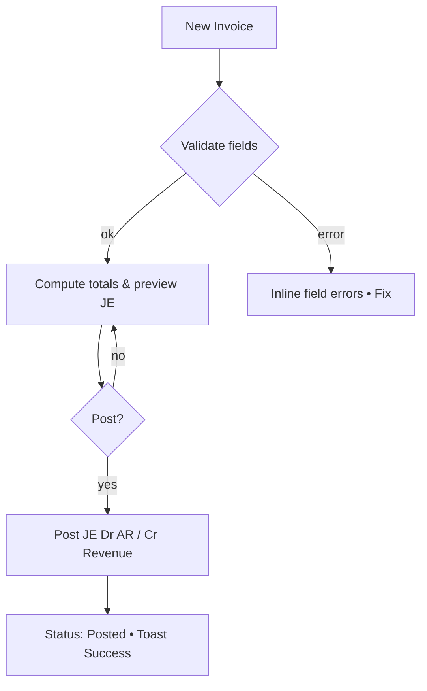
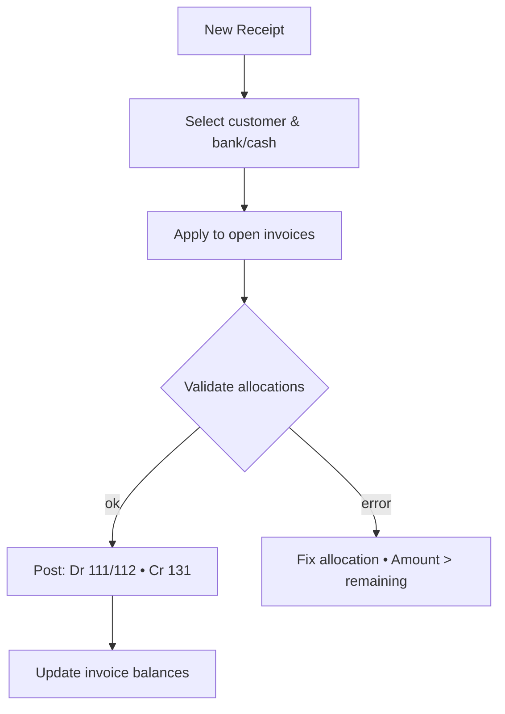

# accounting UX Design Specification

_Created on 2025-11-10 by thanhtoan_
_Generated using BMad Method - Create UX Design Workflow v1.0_

---

## Executive Summary

An enterprise-focused accounting ERP website with RAG-powered chatbot. Primary users are Accountants and Admins in the accounting domain. The product delivers TT200-compliant GL, AR/AP, cash/bank management, and statutory reports with near real-time BI dashboards, reinforced by strict RBAC, audit trails, and multi-tenant company scoping. The embedded Vietnamese-first UI emphasizes speed, accuracy, and clarity; the chatbot provides context-aware guidance with citations to accelerate daily workflows.

---

## 1. Design System Foundation

### 1.1 Design System Choice

Chosen: shadcn/ui (Tailwind + Radix primitives)

Rationale: highly customizable while staying minimal; professional look that aligns with “efficient/productive” and “trustworthy” goals; strong accessibility defaults; easy theming via CSS variables; fits our React + Vite stack and table-heavy desktop UI. Provides button, form, dialog, sheet, table, dropdown, toast patterns we’ll standardize on; custom components will extend these primitives for voucher line grids and report tables.

---

## 2. Core User Experience

### 2.1 Defining Experience

Create and post vouchers/invoices with rapid data entry and auto-validation (inline field checks, keyboard-first editing, immediate balance validation, and clear error recovery). Primary KPIs: time-to-post, error rate, and user perceived responsiveness during line-item entry.

### 2.2 Novel UX Patterns

<!-- novel_ux_patterns -->

---

### 2.3 Desired Emotional Response

Efficient/productive and professional/trustworthy — the interface should feel fast, reliable, and precise, reinforcing confidence during voucher and invoice posting while minimizing cognitive load.

## 3. Visual Foundation

### 3.1 Color System

Brand palette (provided):

- Primary: #0040FF
- Sky Light: #CCE9FF
- Off‑white: #F9F4F1
- Sky: #76C3FC
- Accent (Warning/CTA): #FD6F00
- Accent 2: #E8AAFF

Semantic usage (initial):

- Primary (actions, links, focus): #0040FF
- Secondary (surfaces, subtle accents): #CCE9FF / #76C3FC
- Accent (alerts/attention, tertiary CTA): #FD6F00
- Neutral backgrounds: #F9F4F1 with gray scale from UI system
- Info: #76C3FC
- Error: #DC2626 (on-error text: #FFFFFF, hover: #B91C1C) — meets WCAG AA with white text for normal-size UI text/buttons
- Success: #16A34A (on-success text: #FFFFFF, hover: #15803D) — meets WCAG AA with white text for normal-size UI text/buttons
- Note: For light “surface” alerts, use dark text on light tints:
  - Error surface: #FEE2E2 with text #7F1D1D
  - Success surface: #ECFDF5 with text #065F46
  - Info surface: #E0F2FE with text #075985

**Interactive Visualizations:**

- Color Theme Explorer: [ux-color-themes.html](./ux-color-themes.html)

---

## Inspiration & UX Pattern Notes

References:

- Wave Accounting: https://www.waveapps.com/accounting
- MISA AMIS Kế Toán: https://amis.misa.vn/amis-ke-toan/

Observations to adopt:

- Clean, comprehensive dashboard overview (cash flow, expense breakdown, P&L snapshot) with quick actions and “getting started” tips.
- Left sidebar navigation with clear module grouping (Sales, Purchases, Banking, Accounting, Payroll, Reports, Settings) for 1‑click access.
- Invoice customization excellence (logo, brand colors, personalized messages) and responsive preview (desktop/mobile).
- Point‑and‑click simplicity in billing/invoicing: inline vendor/customer edits without context switching.
- Low learning curve onboarding: prominent setup guidance, bank connection CTA, contextual help.

Implications for our app:

- Dashboard: information‑dense but scannable cards and charts; highlight AR/AP statuses and “Coming Due”.
- Navigation: persistent left sidebar; keyboard shortcuts for power users; clear active state.
- Invoicing: brandable templates and preview; inline edits; fast create→send flow.
- Onboarding: first‑run checklist; smart CTAs for “connect bank”, “add customer/vendor”, “create first voucher/invoice”.

---

## 4. Design Direction

### 4.1 Chosen Design Approach

Chosen Direction: Hybrid — “Table Pro” + “Dense Dashboard”

Layout Decisions:

- Navigation pattern: Persistent left sidebar; top hero for key actions and status.
- Content structure: Dashboard uses dense KPI grid + charts; transaction screens use wide, keyboard-friendly tables with sticky header/footer.
- Content organization: Table-first for vouchers; cards for summaries; inline expansion for quick details.

Hierarchy Decisions:

- Visual density: Dense where users work (dashboard, voucher lists); balanced in secondary views.
- Header emphasis: Subtle headers; strong section titles within content.
- Content focus: Data-first (tables, metrics), with charts as supporting visuals.

Interaction Decisions:

- Primary action pattern: Inline and modal for create/edit; keyboard shortcuts (e.g., Ctrl+S) encouraged.
- Information disclosure: Progressive disclosure on rows (expand for details) to reduce navigation.
- User control: Guided defaults with flexible advanced options.

Visual Style Decisions:

- Weight: Minimal-to-balanced; crisp borders; subtle elevation.
- Depth cues: Flat base with subtle elevation for focus areas.
- Border style: Subtle to delineate dense information.

Rationale:

- Optimizes for speed and precision in voucher workflows while preserving a comprehensive at-a-glance dashboard for accountants and admins.

**Interactive Mockups:**

- Design Direction Showcase: [ux-design-directions.html](./ux-design-directions.html)

---

## 5. User Journey Flows

### 5.1 Critical User Paths

#### Journey: Sales Invoice (AR)

- Goal: Create → Post sales invoice with rapid entry and validations.
- Entry: Dashboard or Sales → Invoices → New.
- Flow Steps:
  1. Invoice form (single column, sticky header with No/Date/Status)
     - User: select customer, due date; add line items (qty, price, VAT).
     - System: inline validation (required fields, positive amounts), auto-calc totals, Dr AR / Cr Revenue preview.
  2. Preview & Post
     - User: review; press Post (Ctrl+S).
     - System: validate leaf-only accounts, required dimensions; change status to Posted; toast success; lock lines.
  3. Share/Export
     - User: email/send PDF; optional brand customization.
- Error States: missing customer, invalid VAT, unbalanced lines → inline errors; posting to closed period → blocking modal with guidance.
- Success: invoice posted; BI and AR Aging update within latency window.



#### Journey: Customer Payment (AR Receipt)

- Goal: Record customer payment and apply to invoices.
- Entry: Cash/Bank → Receipts → New.
- Flow Steps:
  1. Receipt form (payer, account 111/112, amount).
  2. Apply to Invoices (side panel list: open invoices; allocate amounts).
  3. Post receipt → updates invoice balance/status; JE Dr Cash/Bank / Cr AR.
- Error States: over-apply amount, closed period, missing bank account → inline error.
- Success: invoice moves to Paid/Partially Paid; dashboard tiles update.



#### Journey: Supplier Payment (AP)

- Goal: Pay supplier bill and update AP.
- Entry: Purchases → Payments → New (or from Bill detail).
- Flow Steps:
  1. Select bill(s) to pay; choose bank/cash; amount auto-filled.
  2. Post payment → JE Dr AP / Cr Cash/Bank; bill status updates.
- Error States: paying posted but fully paid bill; closed period.
- Success: AP Aging reflects decrease; toast success.

```mermaid
flowchart TD
  A[New Supplier Payment] --> B[Pick bill(s)]
  B --> C{Validate period & amounts}
  C -- ok --> D[Post: Dr 331 • Cr 112/111]
  D --> E[Bill status updated]
  C -- error --> X[Inline error • Adjust]
```

---

## 6. Component Library

### 6.1 Component Strategy

Use shadcn/ui as the base for primitives and common patterns; extend with focused custom components for accounting workflows.

From shadcn/ui (adopt with theming):

- Buttons, Dropdowns, Inputs, Textarea, Select/Combobox, Badge, Tabs, Tooltip
- Dialog/Sheet, Drawer, Popover, Alert/Toast
- Table (as base), Pagination, Breadcrumb, Sidebar primitives
- Form wrapper with validation messages

Custom or heavily customized components:

- VoucherLineGrid: keyboard-first editable grid (arrow/enter navigation, inline validation, sticky footer totals, dimension pickers per row)
- MoneyInput: localized number formatting (vi-VN), decimal precision, negative handling
- DateRangeFilter: preset ranges + calendar
- DataTablePro: server-side sorting/filtering/pagination, column presets, density toggle, CSV/Excel export
- AccountPicker: searchable TT200 accounts with leaf-only indicator and type badges
- AttachmentDropzone: drag/drop with file preview and size/type validation
- AgingWidget: AR/AP aging tiles with drill-down

Accessibility & i18n:

- Ensure ARIA roles/labels on custom grids and pickers; focus outlines visible
- Vietnamese default locale for numbers/dates; text sourced from i18n dictionary

Tech notes:

- Compose on top of shadcn Table + Radix primitives; avoid reinventing focus/keyboard handling where available
- Use CSS variables from palette; provide density variants (compact/comfortable) for tables and forms

### 6.2 VoucherLineGrid — Detailed Spec

Purpose

- Fast, accurate entry of voucher lines with keyboard-first editing, inline validation, and live balancing.

Anatomy (columns)

- RowNumber (readonly)
- Account (AccountPicker with TT200 data; leaf-only indicator)
- Description (text)
- Debit (MoneyInput)
- Credit (MoneyInput)
- Customer (optional combobox; required for 131)
- Vendor (optional combobox; required for 331)
- Cost Center (optional combobox; required for 154/621 if configured)
- Item (optional combobox; for inventory/COGS)
- Attachment (icon button → AttachmentDropzone)
- Actions (⋮ row menu: Insert above/below, Duplicate, Delete)

States

- Default, Focused cell, Editing, Error (field/row), Disabled (when Posted)
- Row error banner (sub-row) aggregates validation messages

Validation Rules

- Exactly one of Debit or Credit > 0 per row
- Positive amounts only
- Account must be leaf/postable
- Required dimensions by `account_controls`:
  - 131 → Customer required
  - 331 → Vendor required
  - 154/621 (configurable) → Cost Center and/or Item required
- Date must be within open period (checked at post)

Keyboard Interaction

- Arrow keys move cell; Tab/Shift+Tab next/prev cell
- Enter: commit cell; Enter on last cell inserts new row
- Ctrl+N: insert row below; Ctrl+D: duplicate row; Ctrl+Backspace: delete row
- Ctrl+S: Post/Save (delegated to parent form)
- Esc: cancel edit

Mouse Interaction

- Click cell to edit; double-click selects value
- Row menu (⋮) for insert/duplicate/delete

Focus & Navigation

- First editable cell gains focus on row add
- Preserve column focus when moving between rows
- Visible focus ring for accessibility

Footer & Balancing

- Sticky footer shows: Running Debit, Running Credit, Difference (Dr−Cr)
- Balanced state ✓; when out of balance, show ✗ and amount difference

Error Handling

- Inline field errors under cell; tooltip on error icon with rule explanation
- Row banner aggregates multiple errors; clicking jumps to first invalid cell

Performance

- Virtualized rows (windowing) for large vouchers
- Debounced formatting for MoneyInput; computations O(n) per change

Accessibility

- ARIA role="grid"; cells role="gridcell" with aria-colindex/rowindex
- Announce validation errors via aria-live="polite"
- All interactive controls keyboard-accessible

Theming & Density

- Compact (table-compact) and Comfortable (default) density variants
- Uses design tokens for colors, borders, focus outlines

Examples (keyboard hints)

- - Navigate: ↑/↓/←/→, Tab, Shift+Tab
  - New row: Enter on last cell or Ctrl+N
  - Duplicate row: Ctrl+D
  - Delete row: Ctrl+Backspace

Integration Points

- Emits change events with full line payload; parent form computes totals
- Validates against `account_controls` map provided by backend
- Supports async lookups for Customer/Vendor/Item pickers

---

### 6.3 Voucher Templates — Prefilled Debit/Credit

Goal

- Speed up data entry by selecting a document template that auto-fills default Debit and Credit accounts (and optional dimensions) based on the voucher type/context.

Template Library Page

- Location: Transactions → Templates (module-aware), or quick entry from Cash/Bank sidebar (e.g., Cash Receipt templates).
- Structure: list/grid of templates with name, description, default Dr/Cr, and optional tags (Cash, Bank, AR, AP).
- Examples:
  - Cash Receipt (apply to Customer): Dr 111/112 • Cr 131 (Customer required)
  - Cash Payment (to Supplier): Dr 331 • Cr 111/112 (Vendor required)
  - Expense Payment: Dr 642x (Cost Center?) • Cr 111/112
  - Sales Return: Dr 531 • Cr 511 (or as configured)

Behavior

- Selecting a template launches the Voucher Form prefilled:
  - VoucherLineGrid first row gets default Account (Debit/Credit) set according to template.
  - Dimensions marked required by template or account_controls are highlighted until filled.
  - Option: lock default accounts (read-only) with a lock icon; toggle “Allow override” in header.
- Users can add additional rows; defaults apply only to the first line unless template defines multi-line patterns.
- Template can include computed suggestions (e.g., set Credit account from Customer or Item category) via server rules.

Integration with VoucherLineGrid

- On template selection, emit `applyTemplate(templateId)` event to grid; grid populates Dr/Cr and sets per-cell placeholders.
- Grid displays a small chip per row showing source: “From Template”.
- When override is off, Account cells render as read-only; when on, becomes editable with warning.

Validation

- Normal grid validations still apply (leaf-only, positive amounts, required dimensions). Template defaults are hints, not bypasses.

Wireframe Touchpoints

- Add quick-entry buttons on Dashboard hero: “+ New Voucher”, and on click show template chooser modal.
- In Voucher List, Ctrl+N opens chooser with recent templates.

---

### 6.4 DataTablePro — Detailed Spec

Purpose

- Table foundation for list screens (Vouchers, Invoices, Bills) supporting enterprise-scale datasets with server-side operations and power-user ergonomics.

Capabilities

- Server-side pagination, sorting (multi-column), filtering, and search
- Column presets (save/load), density toggle (compact/comfortable), column visibility
- Bulk selection with toolbar actions (Post/Delete/Export/Clear)
- Keyboard: ↑/↓ navigate, Enter open, Space select, / focus search, Esc clear, Ctrl+N new
- Row action menu (⋮): View, Edit, Duplicate, Delete (respecting RBAC)
- Export CSV/Excel with current filters; debounce and cancel in-flight requests

API Contract

- Input: { page, pageSize, sort: [{field, dir}], filters: {field→value}, search }
- Output: { rows, totalCount }
- Error: { message, code } → render inline banner; retry

Columns & Cells

- Support renderers: text, money, date, status pill, link, button, menu
- Sort indicators ↑↓ in header; accessible aria-sort

Selection & Bulk

- Checkbox per row; header checkbox selects current page
- Bulk toolbar appears when >0 selected; shows count and actions

Performance

- Virtual scrolling (windowing) for large pages
- Request cancellation and race prevention; optimistic UI for selection state

Accessibility

- Row focus outline, column header buttons keyboard accessible
- Table role=grid; cells gridcell; descriptive headers for SR

Theming

- Uses design tokens; integrates with palette; respects high-contrast

---

### 6.5 AccountPicker — Detailed Spec (TT200-aware)

Purpose

- Fast, searchable account selection compliant with Circular 200; prevents choosing non-postable (parent) accounts and shows metadata.

Data & Props

- Props: { value, onChange, allowOverride=false }
- Data shape: { code, nameVi, type (Debit/Credit/Hermaphrodite), group, isLeaf, postable }

UI/Behavior

- Combobox with search by code prefix and unaccented Vietnamese name
- Options show: code • name • badges (Group, Balance side); non-leaf dimmed and disabled
- Leaf-only guard: cannot select parent; tooltip explains reason
- When allowOverride=false and a template locked the account, render as read-only chip with lock icon + tooltip

Keyboard & Accessibility

- Typeahead search; ↑/↓ navigate options; Enter select; Esc close
- aria-expanded/activeDescendant; proper labeling for SR

Validation & Integration

- Emits onChange with selected account; parent validates dimensions via `account_controls`
- Exposes helper getAccountMeta(code) for downstream rules (e.g., require customer for 131)

Theming

- Matches shadcn/ui Combobox; badges use semantic colors; high-contrast supported

---

### 6.6 MoneyInput — Detailed Spec

Purpose

- Locale-aware currency input for amounts with strict formatting and validation suited for accounting.

Behavior

- Displays formatted value per vi-VN (grouping '.', decimal ',') while maintaining a canonical numeric model
- Accepts numeric keyboard entry only (optional allow negative for reversals)
- On blur: formats; on focus: shows raw editable value
- Validates positive-only for standard lines; configurable allowNegative
- Precision: 0 or 2 decimals (configurable); clamp to max safe integer

Props & Events

- Props: { value:number, onChange, allowNegative?:boolean, decimals?:0|2, placeholder?, disabled? }
- Emits onChange(number|null) on every valid change; rejects invalid keystrokes

Keyboard & Accessibility

- ArrowUp/Down step by 1 (or 1000 with Shift)
- Ctrl+C/V/X work on raw value
- Proper labeling; aria-invalid on error

Error States

- Out-of-range, non-numeric, negative when disallowed → inline message beneath

Theming

- Matches shadcn/ui Input; uses tokens for error/success states

---

### 6.7 DateRangeFilter — Detailed Spec

Purpose

- Quick filter for list screens with common presets and calendar selection.

Presets

- Today, Yesterday, This Week, Last 7 Days, This Month, Last Month, Quarter-to-date, Year-to-date, Custom

Behavior

- Clicking preset updates query immediately; Custom opens dual-calendar picker
- Emits { startDate, endDate, presetKey } to DataTablePro; persists last used in user preferences

UI

- Button + dropdown with preset list; current selection shown as chip
- Custom range shows two calendars with month navigation and Apply/Cancel

Accessibility

- Keyboard navigation across presets and calendar
- aria-selected on active preset; SR-friendly labels

---

## 7. UX Pattern Decisions

### 7.1 Consistency Rules

Button hierarchy:

- Primary: solid `--primary` (actions that commit: Post, Save).
- Secondary: subtle `--secondary-50` background with border for neutral actions.
- Tertiary: ghost text buttons; minimal emphasis.
- Destructive: solid `--error` with white text; confirmation required.

Feedback patterns:

- Success: toast (top-right), auto-dismiss 3.5s, with optional “View” action.
- Error: inline near field/row; blocking errors via modal with guidance.
- Warning/Info: inline banners; avoid modal unless blocking.
- Loading: skeletons for tables; in-button spinner during post.

Form patterns:

- Labels above inputs; required indicated by asterisk and aria-required.
- Validation onBlur and onSubmit; errors inline under field/row.
- Help text: caption under input; tooltips for accounting hints.
- Keyboard: Enter to move to next cell; Ctrl+S to Save/Post.

Modal patterns:

- Sizes: sm (confirm), md (edit forms), lg (previews).
- Dismiss: Escape and explicit close; click outside disabled for destructive confirms.
- Focus: initial focus to primary action or first invalid field.

Navigation patterns:

- Active state: highlight left sidebar item; breadcrumb on detail.
- Back behavior: browser back supported; in-app back for modals/sheets.

Empty states:

- First use: brief explainer + CTA (“Create first voucher”).
- No results: helpful copy + “Reset filters”.

Confirmation patterns:

- Delete/irreversible: modal confirm; provide undo where feasible.
- Unsaved changes: prompt on navigation away from edited Draft.

Notification patterns:

- Top-right toasts; stack up to 3; newer pushes older down; manual dismiss allowed.

Search patterns:

- Global search (Ctrl+K) for vouchers/customers/suppliers.
- Tables: quick search + server-side advanced filters.

Date/time patterns:

- Format `dd/MM/yyyy`, Vietnamese locale numbers; timezone user-local.
- Pickers: calendar dropdown; clear button; keyboard entry supported.

---

## 8. Responsive Design & Accessibility

### 8.1 Responsive Strategy

Primary platform: Desktop web app (1920×1080, 1366×768). Tablet-friendly viewing for reports/approvals as secondary. Strategy: desktop-first layouts with information-dense tables and sticky headers/footers for voucher forms; ensure keyboard navigation and focus states for all interactive elements; meet AA contrast.

---

## 9. Implementation Guidance

### 9.1 Completion Summary

Excellent work! Your UX Design Specification is complete.

What we created together:

- Design System: shadcn/ui with custom components (`VoucherLineGrid`, `DataTablePro`, `AccountPicker`, etc.)
- Visual Foundation: brand palette (primary #0040FF) with AA-compliant Success (#16A34A) and Error (#DC2626), plus surfaces and text pairings
- Design Direction: Hybrid “Table Pro + Dense Dashboard” focused on speed, precision, and dense information
- User Journeys: Sales Invoice, Customer Payment, Supplier Payment, and Journal Voucher with Mermaid diagrams
- UX Patterns: Decisions for buttons, feedback, forms, modals, navigation, notifications, search, and date/time
- Responsive & Accessibility: Desktop-first with AA contrast, keyboard navigation, and Vietnamese locale

Deliverables:

- UX Design Document: this file (`docs/ux-design-specification.md`)
- Color Theme Visualizer: `docs/ux-color-themes.html`
- Design Direction Mockups: `docs/ux-design-directions.html`

Next steps:

- Wireframes for key screens (Dashboard, Voucher List, Voucher Form, Sales Invoice)
- Component specs detailed for `VoucherLineGrid` interactions and states
- Optional: validate with

---

## Appendix

### Related Documents

- Product Requirements: `./PRD.md`
- Product Brief: `./product-brief.md` <!-- if exists -->
- Brainstorming: `./brainstorming.md` <!-- if exists -->

### Core Interactive Deliverables

This UX Design Specification was created through visual collaboration:

- **Color Theme Visualizer**: ./ux-color-themes.html

  - Interactive HTML showing all color theme options explored
  - Live UI component examples in each theme
  - Side-by-side comparison and semantic color usage

- **Design Direction Mockups**: ./ux-design-directions.html
  - Interactive HTML with 6-8 complete design approaches
  - Full-screen mockups of key screens
  - Design philosophy and rationale for each direction

### Optional Enhancement Deliverables

_This section will be populated if additional UX artifacts are generated through follow-up workflows._

<!-- Additional deliverables added here by other workflows -->

### Next Steps & Follow-Up Workflows

This UX Design Specification can serve as input to:

- **Wireframe Generation Workflow** - Create detailed wireframes from user flows
- **Figma Design Workflow** - Generate Figma files via MCP integration
- **Interactive Prototype Workflow** - Build clickable HTML prototypes
- **Component Showcase Workflow** - Create interactive component library
- **AI Frontend Prompt Workflow** - Generate prompts for v0, Lovable, Bolt, etc.
- **Solution Architecture Workflow** - Define technical architecture with UX context

### Version History

| Date       | Version | Changes                         | Author    |
| ---------- | ------- | ------------------------------- | --------- |
| 2025-11-10 | 1.0     | Initial UX Design Specification | thanhtoan |

---

_This UX Design Specification was created through collaborative design facilitation, not template generation. All decisions were made with user input and are documented with rationale._
